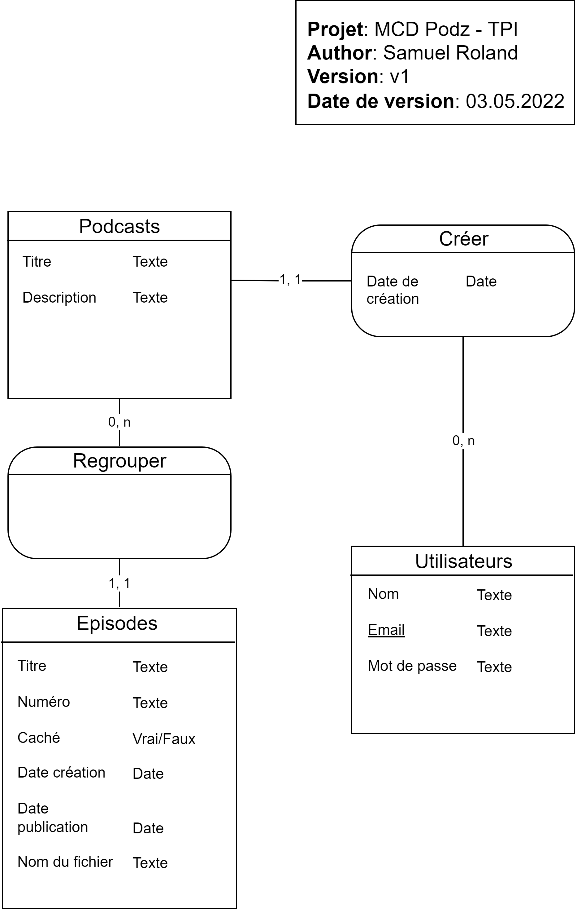

# Documentation de Podz
Projet de TPI de Samuel Roland.

## Analyse préliminaire
### Introduction
todo: import sections du canva.

**Table des matières**
- [Documentation de Podz](#documentation-de-podz)
  - [Analyse préliminaire](#analyse-préliminaire)
    - [Introduction](#introduction)
    - [Base de données](#base-de-données)
      - [MCD](#mcd)
      - [MLD](#mld)

### Base de données
#### MCD

En dehors des champs évidents qui n'ont pas besoin d'explications, voici quelques aspects techniques demandant des explications.
**Dans Episodes**:
- La combinaison du Numéro et du podcast est unique (exemple: on ne peut pas avoir 2 fois l'épisode 4 du podcast "Summer stories").
- La date de création est définie par la date de création de l'épisode sur la plateforme (avec l'upload du fichier), peu importe ses autres informations (la publication ou l'état caché n'a pas d'influence sur la date). Cette date ne change jamais.
- La date de publication est par défaut nulle. Quand elle n'est pas nulle, la date de publication peut être dans le passé comme le futur. Si elle est dans le futur, l'épisode n'est pas encore publié (jusqu'à la date définie). Ceci permet de programmer dans le futur une publication.
- Le champ Caché est par défaut à Faux et n'a pas d'effet dans ce cas. S'il est Vrai, l'épisode ne sera pas visible dans les détails du podcast.

**Dans Podcasts**:
- La combinaison du titre et de l'auteur est unique. Exemple: Michelle ne peut pas publier 2 podcasts s'appelant "My story", par contre Michelle et Bob peuvent chacun publier 1 podcast nommé "My story".

#### MLD
todo