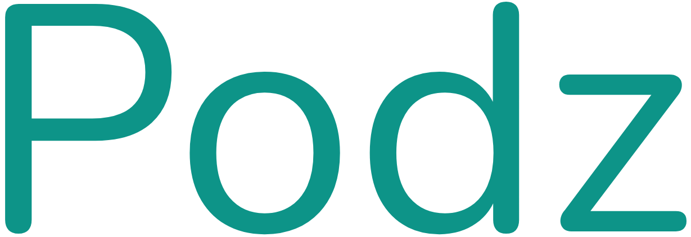
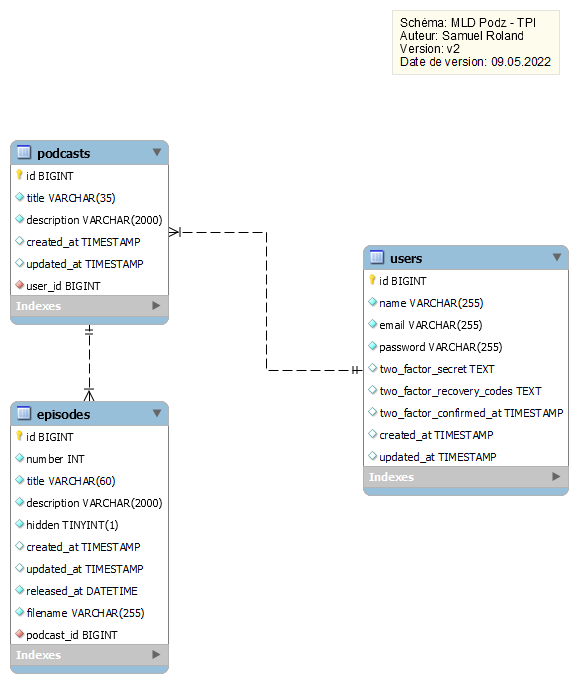
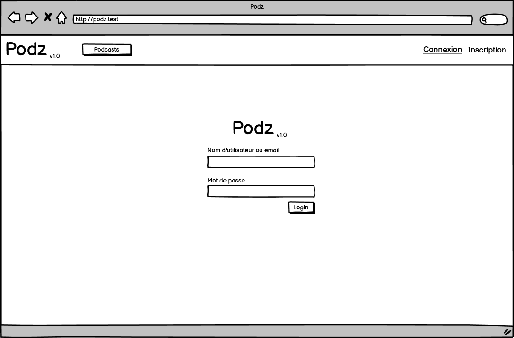
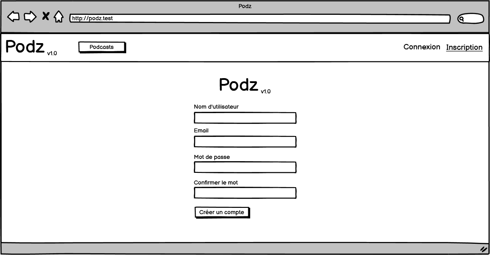
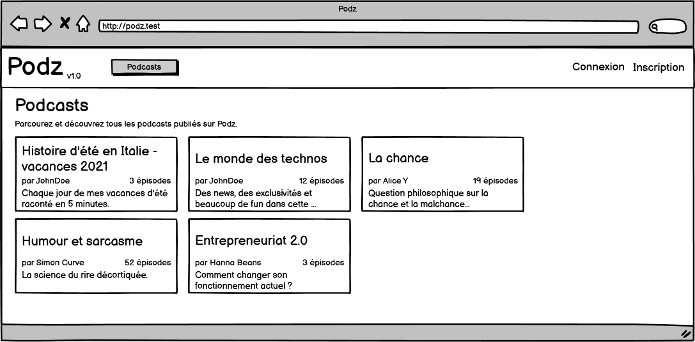

<div style="text-align: center; padding: 150px 0px;">
<p style="text-align: center; border: none; font-size: 3rem;">Documentation de Podz</p>
<p style="text-align: center; border: none; font-size: 2rem;">Application web de publication de podcasts</p>
<div style="display:flex; padding: 50px 100px; justify-content: center; font-family: Fira Code;">

</div>
<h2 style="text-align: center; font-size: 1.6rem;">Projet TPI - 2022</h2>
<h2 style="text-align: center; font-size: 1.3rem;">Samuel Roland</h2>

</div>

<div class="page"/> 

## Analyse préliminaire

**Table des matières**
- [Analyse préliminaire](#analyse-préliminaire)
  - [Introduction](#introduction)
  - [Objectifs](#objectifs)
  - [Planification initiale](#planification-initiale)
- [Analyse / Conception](#analyse--conception)
  - [Concept](#concept)
    - [Technologies utilisées](#technologies-utilisées)
    - [Base de données: MCD](#base-de-données-mcd)
    - [Base de données: MLD](#base-de-données-mld)
    - [Maquettes](#maquettes)
    - [Choix de conception](#choix-de-conception)
  - [Stratégie de test](#stratégie-de-test)
  - [Risques techniques](#risques-techniques)
  - [Planification](#planification)
  - [Dossier de conception](#dossier-de-conception)
    - [Upload d'un fichier audio d'épisode](#upload-dun-fichier-audio-dépisode)
    - [Composants réutilisables](#composants-réutilisables)
- [Réalisation](#réalisation)
  - [Dossier de réalisation](#dossier-de-réalisation)
  - [Description des tests effectués](#description-des-tests-effectués)
  - [Erreurs restantes](#erreurs-restantes)
  - [Liste des documents fournis](#liste-des-documents-fournis)
- [Conclusions](#conclusions)
- [Annexes](#annexes)
  - [Résumé du rapport du TPI / version succincte de la documentation](#résumé-du-rapport-du-tpi--version-succincte-de-la-documentation)
  - [Sources – Bibliographie](#sources--bibliographie)
  - [Journal de travail](#journal-de-travail)
  - [Manuel d'Installation](#manuel-dinstallation)
  - [Manuel d'Utilisation](#manuel-dutilisation)
  - [Archives du projet](#archives-du-projet)

<div class="page"/><!-- saut de page -->

### Introduction

Podz est une application web de publication de podcasts, pour le projet de TPI de Samuel Roland. Les auteurs de podcasts peuvent créer des podcasts, publier des épisodes, planifier la publication d'épisodes dans le futur et cacher des épisodes. L'application est basée sous Laravel 9 et part de zéro. TailwindCSS 3 est utilisé.

### Objectifs

Voici la liste des objectifs à atteindre, tirée du cahier des charges:

**Fonctionnalités générales (reprises d’un ancien projet)**
- Création de comptes utilisateurs.
- Authentification des utilisateurs.
- Il n’y aura pas de partie back-office ni de rôle administrateur.

<!--  bonne endroit ?-->
Ces fonctionnalités sont implémentées par Jetstream, je n'ai donc pas eu besoin de m'en occuper.

**Fonctionnalités détaillées selon le type d’utilisateur**
- En tant que visiteur (personne non authentifiée) :
  - Consultation de la liste des podcasts.
  - Consultation du détail d’un podcast : épisodes
  - Ecoute d’un épisode d’un podcast.
- En tant qu’utilisateur authentifié, en plus des fonctionnalités accessibles à tout visiteur :
    - Création d’un nouveau podcast, édition d’un de ses podcasts existant.  
  - Sur l’un de ses podcasts :
    - Affichage de la liste des épisodes avec toutes les données liées.
    - Ajout d’un nouvel épisode.
    - Edition d’un épisode.
    - Suppression d’un épisode.
<!-- 

Ce chapitre énumère les objectifs du projet. L'atteinte ou non de ceux-ci devra pouvoir être contrôlée à la fin du projet. Les objectifs pourront éventuellement être revus après l'analyse. 

Ces éléments peuvent être repris des spécifications de départ.
-->

### Planification initiale
<!--
Ce chapitre montre la planification du projet. Celui-ci peut être découpé en tâches qui seront planifiées. Il s'agit de la première planification du projet, celle-ci devra être revue après l'analyse. Cette planification sera présentée sous la forme d'un diagramme.

Ces éléments peuvent être repris des spécifications de départ.
-->
<div class="page"/><!-- saut de page -->

## Analyse / Conception
### Concept

#### Technologies utilisées
J'ai choisi la stack **TALL** (*TailwindCSS - AlpineJS - Livewire - Laravel*) pour ce projet, car je suis à l'aise avec ces 4 frameworks et qu'ils permettent d'être assez productif pour développer une application web.

**Petits aperçus de ces frameworks**
- **[Laravel](https://laravel.com/)**: un framework PHP basé sur le modèle MVC et en POO. Cela d'être assez productif, d'avoir accès à beaucoup de classes et fonctions très pratiques, d'avoir une structure imposée... bref de simplifier énormément le développement d'applications web en PHP.
- **[Livewire](https://laravel-livewire.com/)**: un framework pour Laravel permettant de faire des composants fullstack réactifs. L'idée est d'utiliser la puissance de Blade et du PHP pour avoir des parties réactives sur le frontend (normalement codé en Javascript) sans devoir coder des requêtes AJAX nous-mêmes.
- **[AlpineJS](https://alpinejs.dev/)**: un petit framework Javascript relativement simple à apprendre, utilisée ici pour gérer certaines interactions que Livewire ne permet pas, ou qui ne concernent des états d'affichage (là où des requêtes sur le backend seraient inutile notamment). Les composants s'écrivent inline (sur les balises HTML directement). Très pratique pour afficher un dropdown, faire une barre de progression, ...
- **[TailwindCSS](https://tailwindcss.com/)**: un framework CSS, semblable à Bootstrap mais centré autour des propriétés CSS (en ayant des classes utilitaires - "utility-first") au lieu de tourner autour de composants. C'est très puissant pour construire rapidement des interfaces, en écrivant quasiment jamais de CSS pur, et pour faire du responsive c'est très pratique parce qu'on peut préfixer toutes les classes par `md:` par ex. afin dire que la classe ne s'applique que sur les écrans medium et au dessus.

#### Base de données: MCD

En dehors des champs évidents, voici quelques aspects techniques qui demandent des explications.

**Dans Episodes**:
- Les combinaisons du Numéro et du podcast lié, ainsi que le titre et le podcast lié, sont uniques (exemple: on ne peut pas avoir 2 fois un épisode 4 du podcast "Summer stories", et on ne peut pas avoir 2 fois un épisode nommé "Summer 2020 review" du podcast "Summer stories").
- La date de création est définie par la date de création de l'épisode sur la plateforme (avec l'upload du fichier), peu importe ses autres informations (la publication ou l'état caché n'a pas d'influence sur cette date). Cette date ne change jamais et ne sert/est affichée qu'à l'auteur.
- La date de publication peut être dans le passé ou mais aussi dans le futur. Si elle est dans le futur, l'épisode n'est pas encore publié (jusqu'à la date définie). Ceci permet de programmer dans le futur une publication.
- Le champ Caché est par défaut à Faux et n'a pas d'effet dans ce cas. S'il est Vrai, l'épisode ne sera pas visible dans les détails du podcast.

**Dans Podcasts**:
- La combinaison du titre et de l'auteur est unique. Exemple: Michelle ne peut pas publier 2 podcasts s'appelant "My story", par contre Michelle et Bob peuvent chacun publier 1 podcast nommé "My story".

#### Base de données: MLD


Certains champs sont créés par une migration générée par Jetstream, je n'en ai pas besoin mais je ne vais pas les retirer au risque de casser certaines parties existantes. Je n'ai pas créé ce MLD à la main mais je l'ai rétro-ingéniéré depuis la base de données, après avoir codé les migrations.
todo: documenter spécificités.
todo: tables et champs gérés par Laravel...

<!--
Le concept complet avec toutes ses annexes :

Par exemple : 
•	Multimédia: carte de site, maquettes papier, story board préliminaire, …
•	Bases de données: interfaces graphiques, modèle conceptuel.
•	Programmation: interfaces graphiques, maquettes, analyse fonctionnelle…
•	…
-->

#### Maquettes
Pour pouvoir utiliser les fonctionnalités requises, voici la liste complète des pages existantes et leur maquette.

- Page Connexion
- Page Inscription
- Page Liste des podcasts
- Page Détails d'un podcast (visiteur)
- Page Edition des détails d'un podcast (auteur)
- Page Détails d'un podcast (auteur)
- Page Création d'un podcast

**Page Connexion**  


**Page Inscription**  


**Page Liste des podcasts**  
Cette page est visible publiquement et c'est la page par défaut de l'application, on y accède également via le bouton Podcasts en haut à gauche. On peut cliquer sur un podcast pour accéder à ses détails.


**Page Détails d'un podcast (visiteur)**  
Les visiteurs ne voient que les épisodes qui sont visibles et qu'une partie de leurs informations. Ils ne voient que le numéro, le titre, la description, l'audio et le date (arrondie au jour).


<div class="page"/><!-- saut de page -->

**Page Edition des détails d'un podcast (auteur)**  
L'auteur d'un podcast peut gérer les détails de son podcast, autant le titre et la description que les détails et la liste des épisodes. Nous sommes le 09.05.2022 dans cette maquette, l'épisode 4 est caché et le 5 est planifié pour le 10.05.2022. Ici l'auteur crée un 5 ème épisode planifiée qui ne sera publié que le lendemain à 15h08. Il peut aussi éditer les anciens épisodes en cliquant sur l'icône de stylo, ce qui passe l'épisode en mode édition (et permet ainsi de modifier).


<div class="page"/><!-- saut de page -->

**Page Détails d'un podcast (auteur)**  
L'auteur voit évidemment toutes les informations de ses podcasts contrairement au visiteur. (Pour les podcasts d'autres auteurs, il voit la vue visiteur). Nous sommes le 10.05.2022 dans cette maquette, l'épisode 4 est caché et le 5 est planifié pour le 10.05.2022. L'épisode 4 est caché parce que l'auteur a décidé après coup de le remettre en privé.


<div class="page"/><!-- saut de page -->

**Page Création d'un podcast**  
Simple formulaire pour créer un nouveau podcast, avec affichage des erreurs en dessous des champs si jamais les valeurs rentrées sont invalides.


#### Choix de conception
<!-- question: check section ok -->

- Sur la page Podcasts, il y a un résumé des descriptions des podcasts, qui se limitent à 150 charactères (+3 petits points), puisque la description est trop longue pour être affichée entièrement et l'utilisation de `text-overflow: ellipsis` en CSS sur plusieurs lignes n'est pas très simple. Raccourcir en PHP était donc l'autre solution. Un attribute `summary` de la classe `Podcast` permet de récuperer facilement ce résumé. Si la description est plus courte que la limite, la description est utilisée.

### Stratégie de test

<!--

Décrire la stratégie globale de test: 

•	types de des tests et ordre dans lequel ils seront effectués.
•	les moyens à mettre en œuvre.
•	couverture des tests (tests exhaustifs ou non, si non, pourquoi ?).
•	données de test à prévoir (données réelles ?).
•	les testeurs extérieurs éventuels.
-->

### Risques techniques
<!--

•	risques techniques (complexité, manque de compétences, …).

Décrire aussi quelles solutions ont été appliquées pour réduire les risques (priorités, formation, actions, …).
-->
### Planification
<!--
Révision de la planification initiale du projet :

•	planning indiquant les dates de début et de fin du projet ainsi que le découpage connu des diverses phases. 
•	partage des tâches en cas de travail à plusieurs.

Il s’agit en principe de la planification définitive du projet. Elle peut être ensuite affinée (découpage des tâches). Si les délais doivent être ensuite modifiés, le responsable de projet doit être avisé, et les raisons doivent être expliquées dans l’historique.
-->

### Dossier de conception
<!--
Fournir tous les document de conception:

•	le choix du matériel HW
•	le choix des systèmes d'exploitation pour la réalisation et l'utilisation
•	le choix des outils logiciels pour la réalisation et l'utilisation
•	site web: réaliser les maquettes avec un logiciel, décrire toutes les animations sur papier, définir les mots-clés, choisir une formule d'hébergement, définir la méthode de mise à jour, …
•	bases de données: décrire le modèle relationnel, le contenu détaillé des tables (caractéristiques de chaque champs) et les requêtes.
•	programmation et scripts: organigramme, architecture du programme, découpage modulaire, entrées-sorties des modules, pseudo-code / structogramme…

Le dossier de conception devrait permettre de sous-traiter la réalisation du projet !
-->
#### Upload d'un fichier audio d'épisode
J'ai décidé de fixer la taille maximum d'upload de fichiers à 150MB. Cette limite est fixée dans l'application, au niveau de la validation à la création d'un épisode.
Les 2 valeurs dans la configuration de PHP (fichier `php.ini`) doivent être augmentées au dessus de 150MB: `upload_max_filesize` et `post_max_size`.

#### Composants réutilisables

**Le composant Field**
Un composant blade permettant d'abstraire les éléments communs de tous les champs de formulaire, avec quelques réglages possibles. L'affichage du label, le design basique, l'affichage des erreurs de validations.

Propriétés du composant
| Nom           | Type   | Requis | Description                                                                                                          |
|---------------|--------|--------|----------------------------------------------------------------------------------------------------------------------|
| `name`        | String | X      | Le nom technique du champ, utilisé pour l'attribut `name` de l'input et par le `@error()` et par la fonction `old()` |
| `label`       | String |        | Nom du label au dessus du champ                                                                                      |
| `type`        | String |        | Type de l'`<input>`. Par défaut `text`. Si `textarea` est donné, une balise `<textarea>` est utilisée à la place.    |
| `placeholder` | String |        | Un placeholder qui est ajouté directement sur le champ                                                               |
| `cssOnField`  | String |        | Des classes CSS qui sont ajoutées directement sur le champ                                                           |

Tous les autres attributs non reconnus sont transférés à la `div` racine du composant, ce qui permet d'ajouter du style ou d'autres attributs HTML. Tous les attributs commençant par `wire:model` sont ajoutés au champ pour permettre l'utilisation de ce composant avec Livewire.

Exemple d'utilisation:
```php
<form action="{{ route('podcasts.index') }}" method="POST">
<x-field label="Title" name="title"></x-field>
<x-field label="Description" type="textarea" name="description"></x-field>
<x-field label="Date de naissance" type="date" name="user.date"></x-field>
[...]
</form>
```

Un autre exemple d'utilisation dans le cas d'un formulaire géré par Livewire:
```php
<div>
    <x-field wire:keyup.enter="update" placeholder="Rentrez un titre court et marquant." label="Title" name="podcast.title" wire:model.lazy="podcast.title"></x-field>
    <x-field label="Description" type="textarea" name="podcast.description" wire:model.lazy="podcast.description">
    </x-field>
    @csrf
    <button wire:click.prevent="update" class="btn mt-1">Enregistrer</button>
</div>
```
<div class="page"/><!-- saut de page -->

## Réalisation
### Dossier de réalisation

**Structure du repository**:
```
podz                      Racine du repository
├─ app                                        
│   ├─ Actions                                        
│   │   ├─ Fortify                                        
│   │   └─ Jetstream                                        
│   ├─ Console                                        
│   ├─ Exceptions                                         
│   ├─ Http                                         
│   │   ├─ Controllers    Les classes contrôleurs                                    
│   │   ├─ Livewire                                         
│   │   └─ Middleware                                         
│   ├─ Models             Les classes modèles                            
│   ├─ Providers                                        
│   └─ View               Les classes des vues, pour les composant Blade                          
│       └─ Components                                         
├─ bootstrap                                        
│   └─ cache                                        
├─ config                 Les fichiers de configuration globaux                        
├─ database               Tout ce qui concerne la gestion de la base de données                          
│   ├─ factories          Les factories pour créer des données fictives                              
│   ├─ migrations         Les migrations pour définir la structure des tables                                
│   └─ seeders            Les seeders pour remplir la base de données avec les factories                            
├─ docs                                         
│   ├─ imgs                                         
│   ├─ models                                         
│   └─ sources                                        
├─ lang                                         
│   ├─ en                                         
│   └─ fr                                         
├─ public                                         
├─ resources              Toutes les ressources utiles à générer nos vues                          
│   ├─ css                Style CSS global dans app.css                         
│   ├─ js                 Javascript global dans app.js                        
│   ├─ markdown                                         
│   └─ views                                        
│       ├─ api                                        
│       ├─ auth                                         
│       ├─ components                                         
│       ├─ layouts                                        
│       ├─ livewire       Les vues pour Livewire.                                  
│       ├─ podcasts       Vues pour les podcasts                                  
│       ├─ profile                                        
│       └─ vendor                                         
│           └─ jetstream  Les vues de Jetstream                                       
│               └─ ...                                          
├─ routes                 Configuration des routes dans web.php                        
├─ storage                Espace de stockage dédié                        
│   ├─ app                Dossier pointé par le disque "local"                         
│   │   ├─ public         Dossier publiquement accessible et pointe sur le disque "public"                                
│   │   └─ testing        Fichiers audios de tests                                
│   ├─ clockwork                                        
│   ├─ framework                                        
│   │   ├─ cache                                        
│   │   │   └─ data                                         
│   │   ├─ sessions                                         
│   │   ├─ testing                                        
│   │   └─ views                                        
│   └─ logs                                         
├─ tests                                        
│   ├─ Feature                                        
│   ├─ Jetstream                                        
│   └─ Unit                
│                        
│   .editorconfig                                       
│   .env.example          Fichier .env d'exemple                              
│   .gitattributes                                        
│   .gitignore                                        
│   .styleci.yml                                        
│   artisan                                       
│   composer.json         Liste des paquets Composer requis                              
│   composer.lock         Liste des paquets Composer installées et leur version                             
│   package-lock.json     Liste des paquets NPM installées et leur version
│   package.json          Liste des paquets NPM requis                              
│   phpunit.xml           Fichier de configuration de PhpUnit                             
│   README.md                                        
│   tailwind.config.js    Configuration de Tailwind                                    
│   webpack.mix.js        Configuration du build JS et CSS avec Webpack pour Mix
```
<!--

Décrire la réalisation "physique" de votre projet

•	les répertoires où le logiciel est installé
•	la liste de tous les fichiers et une rapide description de leur contenu (des noms qui parlent !)
•	les versions des systèmes d'exploitation et des outils logiciels
•	la description exacte du matériel
•	le numéro de version de votre produit !
•	programmation et scripts: librairies externes, dictionnaire des données, reconstruction du logiciel - cible à partir des sources.

NOTE : Evitez d’inclure les listings des sources, à moins que vous ne désiriez en expliquer une partie vous paraissant importante. Dans ce cas n’incluez que cette partie…
-->
### Description des tests effectués
<!--

Pour chaque partie testée de votre projet, il faut décrire:

•	les conditions exactes de chaque test
•	les preuves de test (papier ou fichier)
•	tests sans preuve: fournir au moins une description 
-->
### Erreurs restantes  
<!--

S'il reste encore des erreurs: 

•	Description détaillée
•	Conséquences sur l'utilisation du produit
•	Actions envisagées ou possibles
-->

### Liste des documents fournis
<!--

Lister les documents fournis au client avec votre produit, en indiquant les numéros de versions 

•	le rapport de projet
•	le manuel d'Installation (en annexe)
•	le manuel d'Utilisation avec des exemples graphiques (en annexe)
•	autres…
-->

<div class="page"/><!-- saut de page -->

## Conclusions
<!--

Développez en tous cas les points suivants:

•	Objectifs atteints / non-atteints
•	Points positifs / négatifs
•	Difficultés particulières
•	Suites possibles pour le projet (évolutions & améliorations)

 -->
## Annexes

### Résumé du rapport du TPI / version succincte de la documentation

### Sources – Bibliographie
- Icônes: les icônes ont été copié-collées (en SVG) depuis [heroicons.com](https://heroicons.com/), elle sont publiées sous licence MIT.

- [Liste des Types de médias, par l'IANA](https://www.iana.org/assignments/media-types/media-types.xhtml). Cette ressource m'a été utile pour trouver les types MIME des fichiers audios .ogg, .opus, .mp3 et .m4a.
<!--

Liste des livres utilisés (Titre, auteur, date), des sites Internet (URL) consultés, des articles (Revue, date, titre, auteur)… Et de toutes les aides externes (noms)   
-->
### Journal de travail

### Manuel d'Installation

### Manuel d'Utilisation

### Archives du projet 

<!-- 
Media, … dans une fourre en plastique 
-->