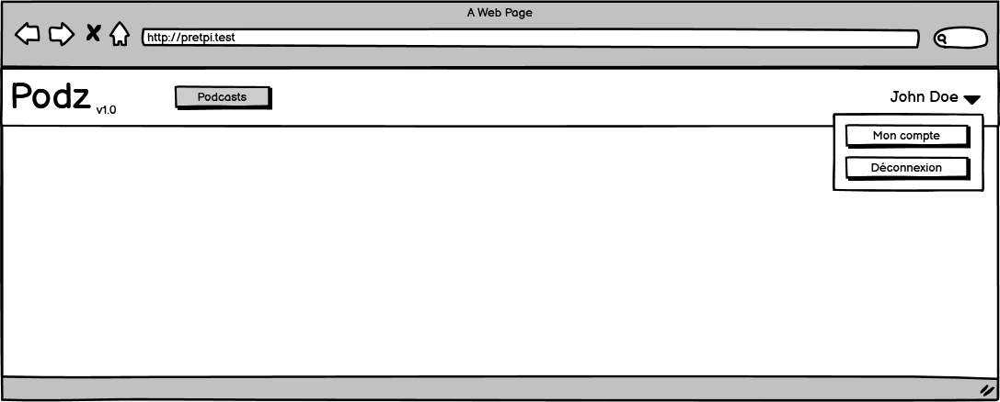
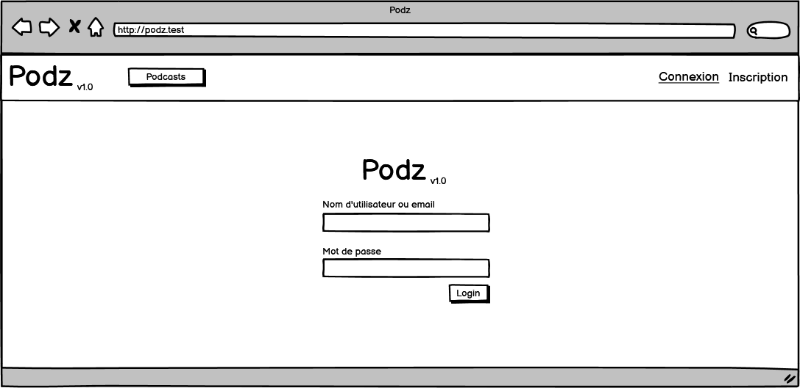

<div style="text-align: center; padding-top: 150px;">
<p style="text-align: center; border: none; font-size: 50px; font-weight: 500;">Documentation de Podz</p>
<p style="text-align: center; border: none; font-size: 2rem;">Application web de publication de podcasts</p>
<div style="display:flex; padding: 50px 100px; justify-content: center; font-family: Fira Code;">

</div>
<div style="display: flex; justify-content: center; margin-bottom: 50px;">


</div>

<h2 style="text-align: center; border: none; font-size: 35px;">Projet TPI - 2022</h2>
<h2 style="text-align: center; border: none; font-size: 1.5rem;">Samuel Roland, SI-MI4A</h2>
</div>

<div class="page"/> 


<div style="font-size: 28px; margin-top: 20px;">Table des matières</div>

<!-- toc start -->
<div class="toc">

- [Analyse préliminaire](#analyse-préliminaire)
  - [Introduction](#introduction)
  - [Glossaire](#glossaire)
  - [Objectifs](#objectifs)
  - [Planification initiale](#planification-initiale)
- [Analyse / Conception](#analyse--conception)
    - [Technologies utilisées](#technologies-utilisées)
    - [Outils d'aide](#outils-daide)
    - [Modèle Conceptuel de Données](#modèle-conceptuel-de-données)
    - [Modèle Logique de Données](#modèle-logique-de-données)
    - [Maquettes](#maquettes)
  - [Stratégie de test](#stratégie-de-test)
    - [Où sont écrits les tests ?](#où-sont-écrits-les-tests-)
    - [Les données de tests](#les-données-de-tests)
    - [Comment lancer les tests ?](#comment-lancer-les-tests-)
  - [Planification](#planification)
  - [Dossier de conception](#dossier-de-conception)
    - [Résumé des podcasts](#résumé-des-podcasts)
    - [Visibilité des épisodes](#visibilité-des-épisodes)
    - [Traduction](#traduction)
    - [Vues de Jetstream](#vues-de-jetstream)
    - [Routes](#routes)
    - [Upload d'un fichier audio pour la création d'un épisode](#upload-dun-fichier-audio-pour-la-création-dun-épisode)
    - [Éléments réutilisables](#éléments-réutilisables)
- [Réalisation](#réalisation)
  - [Dossier de réalisation](#dossier-de-réalisation)
  - [Construction de la documentation](#construction-de-la-documentation)
  - [Résultats des tests effectués](#résultats-des-tests-effectués)
    - [Couverture des tests](#couverture-des-tests)
  - [Liste des documents fournis](#liste-des-documents-fournis)
- [Conclusions](#conclusions)
  - [Objectifs atteints / non-atteints](#objectifs-atteints--non-atteints)
  - [Difficultés particulières](#difficultés-particulières)
  - [Points positifs / négatifs](#points-positifs--négatifs)
  - [Bilan personnel](#bilan-personnel)
  - [Suites possibles pour le projet](#suites-possibles-pour-le-projet)
  - [Remerciements](#remerciements)
- [Annexes](#annexes)
  - [Résumé du rapport du TPI](#résumé-du-rapport-du-tpi)
  - [Sources – Bibliographie](#sources--bibliographie)
  - [Journal de travail](#journal-de-travail)
  - [Manuel d'installation](#manuel-dinstallation)
  - [Archives du projet](#archives-du-projet)

<!-- toc end -->

</div>

<div class="page"/><!-- saut de page -->

## Analyse préliminaire
### Introduction

Podz est une application web de publication de podcasts, développée pour le TPI de Samuel Roland en SI-MI4A. Les auteurs peuvent créer des podcasts, publier et gérer des épisodes, planifier la publication d'épisodes dans le futur et les cacher. L'application est basée sous Laravel 9 et ne part pas d'un projet existant.

### Glossaire

- **AJAX**: Asynchronous JavaScript and XML: méthode pour faire des requêtes HTTP en arrière-plan dans un navigateur afin d'éviter un rechargement complet de la page 
- **BDD**: Behaviour Driven Development
- **Blade**: moteur de vue de Laravel
- **CSS**: Cascading Style Sheets
- **Framework**: ensemble de librairies et de conventions qui donnent un cadre pour développer une application
- **HTML**: Hypertext Markup Language
- **IDE**: Integrated Development Environment
- **JS**: JavaScript
- **MCD**: Modèle Conceptuel de Données
- **MLD**: Modèle Logique de Données
- **MVC**: Modèle Vue Contrôleur
- **PHP**: PHP Hypertext Preprocessor
- **POO**: Programmation orientée objet
- **RSS**: RDF Site Summary ou Really Simple Syndication: système de flux web pour diffuser du contenu (articles, podcasts, ...)
- **Stack**: ensemble cohérent de technologies pour un but donné
- **Starter kit**: kit de démarrage permettant de sauter les premières étapes
- **TALL**: TailwindCSS - AlpineJS - Livewire - Laravel : stack de 4 frameworks web

<div class="together">

### Objectifs

Voici la liste des objectifs à atteindre, tirée du cahier des charges:

**Fonctionnalités générales (reprises d’un ancien projet)**
- Création de comptes utilisateurs.
- Authentification des utilisateurs.
- Il n’y aura pas de partie back-office ni de rôle administrateur.

Ces fonctionnalités sont implémentées par Jetstream, je n'ai donc pas besoin de les implémenter.

**Fonctionnalités détaillées selon le type d’utilisateur**
- En tant que visiteur (personne non authentifiée) :
  - Consultation de la liste des podcasts.
  - Consultation du détail d’un podcast : épisodes
  - Ecoute d’un épisode d’un podcast.
- En tant qu’utilisateur authentifié, en plus des fonctionnalités accessibles à tout visiteur :
    - Création d’un nouveau podcast, édition d’un de ses podcasts existant.  
  - Sur l’un de ses podcasts :
    - Affichage de la liste des épisodes avec toutes les données liées.
    - Ajout d’un nouvel épisode.
    - Edition d’un épisode.
    - Suppression d’un épisode.
</div>

**En plus de cela, le travail sera évalué sur les 7 points spécifiques suivants:**
1. Modélisation des données pertinentes (types, tailles, associations).
1. Respect du modèle MVC.
1. Ergonomie de l’interface utilisateur.
1. Gestion des erreurs de saisie des utilisateurs.
1. Respect des normes d’écriture de code.
1. Utilisation d’un SCM type git avec commits atomiques, petits et fréquents.
1. Lecture audio du podcast bien réalisée.

### Planification initiale
Le projet n'a pas de méthode de gestion de projet formel, mais plutôt une adaptation de la méthode Scrum (je travaille en Sprint et mon chef de projet vient de faire des retours 1 fois par cycle). Je ne voulais pas partir avec des gros outils comme IceScrum, j'ai préféré partir sur GitHub Projects et gérer des Issues dans des Kanbans. Les étiquettes des Issues indiquent le temps estimé (ex : `t-3` = temps estimé de 3h). Le projet se découpe en 5 sprints, la majorité durent 1 semaine, entre le 02.05.2022 et le 31.05.2022. Comme demandé par l’expert 1, une tâche de documentation quotidienne (avec 4 cases à cocher pour les 4 jours de travail) existe pour chaque sprint (ce qui donne 1h par jour).

**Dates des sprints**:
- **Sprint 1**: du 02.05.2022 au 06.05.2022
- **Sprint 2**: du 09.05.2022 au 13.05.2022
- **Sprint 3**: du 16.05.2022 au 20.05.2022
- **Sprint 4**: du 23.05.2022 au 27.05.2022
- **Sprint 5**: du 30.05.2022 au 31.05.2022

Voici à quoi ressemble mes kanbans pour chaque Sprint:


La planification initiale rendue le premier jour dans un document séparé avait une mise en page peu pratique, j'ai donc repris les données et j'ai changé l'affichage pour plus de lisibilité. L'ordre des tâches est le même qu'il y avait dans les colonnes Todo sur GitHub au début du projet.  
:[fragment](markdown-build/planification-initiale.md)

<div class="page"/>

## Analyse / Conception

#### Technologies utilisées
J'ai choisi la stack **TALL** (*TailwindCSS - AlpineJS - Livewire - Laravel*) pour ce projet, car je suis à l'aise avec ces 4 frameworks et parce qu'ils permettent d'être productif pour développer une application web.

**Petits aperçus de ces frameworks**
- **[Laravel](https://laravel.com/)**: un framework PHP basé sur le modèle MVC et en POO. Laravel donne accès à beaucoup de classes et fonctions très pratiques, d'avoir une structure imposée, d'avoir des solutions simples aux problèmes récurrents (traductions, authentification, gestion des dates, ...). Tout ceci simplifie beaucoup le développement d'applications web en PHP une fois qu'on est à l'aise avec les bases.
- **[Livewire](https://laravel-livewire.com/)**: un framework pour Laravel permettant de faire des composants fullstack réactifs. L'idée est d'utiliser la puissance de Blade et PHP pour avoir des parties réactives sur le frontend (normalement codées en Javascript) sans devoir coder des requêtes AJAX.
- **[AlpineJS](https://alpinejs.dev/)**: un petit framework Javascript relativement simple à apprendre, utilisée ici pour gérer certaines interactions que Livewire ne permet pas, ou qui concernent des états d'affichage (là où des requêtes sur le backend seraient inutiles). Les composants s'écrivent inline (sur les balises HTML directement). Très pratique pour afficher un dropdown, faire une barre de progression, ...
- **[TailwindCSS](https://tailwindcss.com/)**: un framework CSS, concurrent de Bootstrap mais centré autour des propriétés CSS (en ayant des classes utilitaires - "utility-first") au lieu de fournir des classes "composants". C'est très puissant pour construire rapidement des interfaces, en écrivant quasiment jamais de CSS pur. Pour faire du responsive c'est très pratique parce qu'il suffit d'utiliser un préfixe d'écran devant n'importe quelle classe pour utiliser des media queries. Par exemple, on peut utiliser `md:text-white` pour dire que le texte est blanc sur les écrans medium et au dessus.

Divers:
- **[Jetstream](https://jetstream.laravel.com/2.x/introduction.html)**: Un starter Kit Laravel mettant en place les fonctionnalités d'authentification, tels que la connexion, la création de compte, la gestion du compte et beaucoup d'autres. L'option Livewire a été utilisée.

<div class="page"/>

#### Outils d'aide
Pour m'aider dans mon développement, j'ai utilisé différent outils, ils ne sont pas requis pour travailler sur Podz, mais peuvent être très utiles:
- **[Clockwork](https://underground.works/clockwork/)**: paquet Composer et extension web pour debugger les performances, les requêtes SQL, voir le temps d'exécution, ... Le paquet Composer est déjà installé.

- **[Laravel Valet](https://laravel.com/docs/9.x/valet)**: fait tourner des serveurs web avec Nginx les rendant accessibles via des domaines en `.test`. Ce qui me permet de faire tourner mon serveur sous `podz.test` en HTTPS sans avoir besoin de me soucier de démarrer et d'arrêter ce serveur ni de gérer plusieurs ports quand plusieurs serveurs sont allumés. L'outil fonctionne pour MacOS, mais des forks pour [Windows](https://github.com/cretueusebiu/valet-windows) et [Linux](https://cpriego.github.io/valet-linux/) existent également. Attention à bien suivre la procédure d'installation pour ne pas être coupé d'internet à cause du DNS local mal configuré.


</div>

<div class="page"/>

#### Modèle Conceptuel de Données

</div>

**Spécificités dans Episodes**:
- Les combinaisons du numéro et du podcast lié, ainsi que le titre et le podcast lié, sont uniques (exemple: on ne peut pas avoir 2 fois un épisode 4 du podcast "Summer stories", et on ne peut pas avoir 2 fois un épisode nommé "Summer 2020 review" du podcast "Summer stories").
- La date de création est définie par la date de création de l'épisode sur la plateforme, peu importe ses autres informations (la publication ou l'état caché n'a pas d'influence sur cette date). Cette date ne change jamais et n'est affichée qu'à l'auteur.
- La date de publication peut être dans le passé ou mais aussi dans le futur. Si elle est dans le futur, l'épisode n'est pas encore publié (jusqu'à la date définie). Ceci permet de programmer dans le futur une publication.
- Le champ Caché est par défaut à Faux et n'a pas d'effet dans ce cas. S'il est Vrai, l'épisode ne sera pas visible dans les détails du podcast.

**Spécificités dans Podcasts**:
- La combinaison du titre et de l'auteur est unique. Exemple: Michelle ne peut pas publier 2 podcasts s'appelant "My story", par contre Michelle et Bob peuvent chacun publier 1 podcast nommé "My story".

<div class="together">

#### Modèle Logique de Données


</div>

Ce MLD n'a pas été fait à la main mais a été rétro-ingéniéré depuis la base de données, après avoir codé les migrations. Certains champs (`two_factor_*`) sont créés par une migration générée par Jetstream, je n'en ai pas besoin mais je ne vais pas les retirer pour ne pas risquer de casser certaines vues existantes. Ce MLD omet volontairement les tables générées par Laravel et propres à chaque application Laravel (`sessions`, `migrations`, ...), une partie provient de migrations créées par Jetstream. Ne vous étonnez donc pas de trouver d'autres tables dans la base de données, je ne les utilise pas directement. 

Les champs `created_at` et `updated_at` sont gérés automatiquement par Laravel (grâce au timestamps activés dans la migration), je n'utilise que le `created_at` en lecture seulement.

<!--
Le concept complet avec toutes ses annexes :

Par exemple : 
•	Multimédia: carte de site, maquettes papier, story board préliminaire, …
•	Bases de données: interfaces graphiques, modèle conceptuel.
•	Programmation: interfaces graphiques, maquettes, analyse fonctionnelle…
•	…
-->
<div class="together">

#### Maquettes
Le gabarit est déjà designé par Jetstream. Voici ce que voit un visiteur (déconnecté):

Et maintenant ce que voit un auteur (connecté):

Pour pouvoir utiliser les fonctionnalités requises, voici la liste complète des pages nécessaires et leur maquette:

- Page Connexion
- Page Inscription
- Page Liste des podcasts
- Page Page Détails d'un podcast
  - Vue visiteur
  - Vue Détails et édition pour auteur
- Page Création d'un podcast

</div>

**Page Connexion**  


**Page Inscription**  


<div class="together">

**Page Liste des podcasts**  
Cette page est visible publiquement et c'est la page par défaut de l'application, on y accède également via le bouton Podcasts en haut à gauche. On peut cliquer sur un podcast pour accéder à ses détails.


</div>

<div class="together">

**Page Détails d'un podcast**

**Vue visiteur**  
Les visiteurs ne voient que les épisodes qui sont visibles et ils ne voient que le numéro, le titre, la description, l'audio et la date (mais sans l'heure et la minute de publication).

</div>

<div class="together">

**Vue Détails et édition pour auteur**  
L'auteur voit toutes les informations de ses podcasts contrairement au visiteur. L'auteur a une vue visiteur sur les podcasts qui ne lui appartiennent pas. Nous sommes le 09.05.2022 dans cette maquette, l'épisode 4 est caché et le 5 est planifié pour le 10.05.2022 à 15:08. L'épisode 4 est caché parce que l'auteur a décidé après coup de le remettre en privé. Voici l'apparance de la page quand un auteur la charge.

</div>

<div class="together">

Quand l'auteur clique sur les icônes d'édition, des formulaires s'affichent pour les éléments sélectionnés afin de permettre l'édition ou la suppression. Quand on clique sur `Nouvel épisode...`, le formulaire de création apparaît juste en dessous. On peut éditer plusieurs éléments à la fois, il n'y aura pas de problèmes puisque la page ne se rafraîchit pas mais est découpée en plusieurs composants Livewire.


</div>

<div class="together">

**Page Création d'un podcast**  
Simple formulaire pour créer un nouveau podcast, avec affichage des erreurs en dessous des champs si jamais les valeurs rentrées sont invalides.

</div>

<div class="together">

### Stratégie de test

Cette section concerne la manière dont est testé Podz durant le projet. Je teste manuellement les fonctionnalités dans mon navigateur (Firefox) et j'écris aussi des tests automatisés avec PHPUnit (un framework PHP de tests). La plupart des fonctionnalités sont couvertes par ces tests automatisés et quand cela n'est pas le cas, je regarde à la main si cela fonctionne. 

La stratégie de développement est le BDD (Behaviour Driven Development). Cela consiste à écrire des tests qui testent le comportement avant de coder, s'assurer que le test plante, puis développer jusqu'à que le test passe. Ensuite on peut refactoriser pour augmenter la qualité tout en s'assurant que cela fonctionne. J'ai fait quelques tests unitaires mais la majorité sont des tests fonctionnels. Toute la suite de tests est lancée très fréquemment (plusieurs fois par jour) pour s'assurer qu'une nouvelle fonctionnalité n'a pas cassé une autre en chemin.
</div>
<!-- todo: check BDD meaning -->

#### Où sont écrits les tests ?
Tous les tests se trouvent dans le dossier `tests` à la racine du repository. Le dossier `Feature` contient les tests fonctionnels, `Unit` les tests unitaires et `Jetstream` les tests créé par Jetstream (ces derniers ont été retiré de `Feature` afin de ne pas les exécuter constamment).

#### Les données de tests

<!-- todo: à corriger -->
Des factories et le seeder ont été codés pour ne pas devoir rentrer des valeurs à la main. Dans mon seeder `DatabaseSeeder` je génére peu d'éléments (minimum de 2) pour les tests automatisés, afin d'accélérer l'exécution. Je génère plus d'éléments pour l'application locale afin d'avoir une situation plus réaliste dans le navigateur. Dans `EpisodeFactory`, j'ai fait en sorte que les épisodes soient toujours visibles et publiés dans le passé (afin d'éviter des tests qui plantent à cause de cette partie aléatoire non supportée). Quand les tests doivent avoir des épisodes cachés (pour tester les cas de visibilité), ils en créent eux-mêmes quelques-uns avant.

Etant le choix par défaut dans Laravel, j'ai utilisé le paquet Faker dans mes factories pour générer différents types de données. Le texte généré est en Lorem Ipsum. Ce qui est pratique comparé à l'écriture de données manuelles, c'est qu'on peut avoir des textes très longs permettant de valider dans nos interfaces que les valeurs extrèmes sont correctement affichées.

**Exemple de données fictives générées par Faker**:


Avant chaque test, on retourne à l'état initiale grâce au trait `RefreshDatabase`. Puis le seeder `DatabaseSeeder` s'exécute grâce au `$seed` défini à `true`. Ces 2 configurations sont faites dans `tests/TestCase.php`, ce qui permet au final que tous les tests sont lancées sur une base de données propre et remplie.

Afin de ne pas impacter la base de données de développement, les tests sont lancés sur une base de données SQLite en mémoire. Voici les lignes en bas du fichier de configuration de PHPUnit `phpunit.xml`, qui redéfinit 2 variables d'environnement permettant d'avoir une base de données en RAM.
```xml
<env name="DB_DATABASE" value=":memory:"/>
<env name="DB_CONNECTION" value="sqlite"/>
```

#### Comment lancer les tests ?
Il est nécessaire d'avoir mis en place le projet et d'avoir l'extension PHP SQLite tout d'arbod. Ensuite, il y a différentes manières de lancer les tests dans un terminal dans le dossier du projet:
- `php artisan test`
- `./vendor/bin/phpunit`
- `phpunit` (seulement si phpunit a été installé séparement/globalement)

Les tests en dehors du dossier `tests/Unit` et `tests/Feature` ne sont pas lancés. Pour exécuter les tests de Jetstream si besoin, il faut lancer `php artisan test tests/Jetstream` ou pour tout inclure `php artisan test tests`.

Vous pouvez passer des paramètres à `phpunit` (fonctionne aussi avec la commande `php artisan test`).

**Exemples**:
1. pour exécuter seulement 1 test nommé `test_podcasts_page_exists` on peut filtrer:  
`php artisan test --filter test_podcasts_page_exists`
1. pour exécuter une classe de tests donnée:  
`php artisan test tests/Feature/PodcastsTest.php`
1. pour exécuter les tests d'un dossier:  
`php artisan test tests/Unit`

Je recommande de configurer un raccourci clavier dans votre IDE pour lancer les tests. J'ai utilisé ce réglage de raccourci dans VSCode pour lancer tous les tests lors d'un `ctrl+t ctrl+t`
```json
{
    "key": "ctrl+t ctrl+t",
    "command": "workbench.action.terminal.sendSequence",
    "args": {
        "text": "php artisan test\u000D"
    }
}
```
<div class="page"/>

### Planification
La liste des tâches est la même qu'au départ, les estimations n'ont pas été modifiées. Afin de comparer ce qui avait été prévu et ce qui s'est réellement passé finalement, j'ai rajouté quelques colonnes. Tout le tableau est ordré par la date d'achèvement des tâches, ce qui explique que ce n'est pas exactement le même ordre que la planification initiale. `S-d` signifie `Sprint de départ` et `S-f` signifie `Sprint final` (est différent pour les tâches achevée en retard ou en avance). Le Delta est la résultat de Temps estimé - Temps passé.
:[fragment](markdown-build/planification-finale.md)

**Comparaison**  
En fait mon sprint 4 est trop long puisque le jeudi et vendredi étaient fériés. TODO.

<!-- ajouter heures diverses non classifiées -->
<!-- commentaire avance et retard, et rattrapage et total, et heures diverse significations.-->
<!--
Révision de la planification initiale du projet :

•	planning indiquant les dates de début et de fin du projet ainsi que le découpage connu des diverses phases. 
•	partage des tâches en cas de travail à plusieurs.

Il s’agit en principe de la planification définitive du projet. Elle peut être ensuite affinée (découpage des tâches). Si les délais doivent être ensuite modifiés, le responsable de projet doit être avisé, et les raisons doivent être expliquées dans l’historique.
-->

### Dossier de conception

#### Résumé des podcasts  
Sur la page Podcasts, il y a un résumé des descriptions des podcasts, qui se limitent à 150 caractères (+3 petits points), puisque la description est trop longue pour être affichée entièrement et l'utilisation de `text-overflow: ellipsis` en CSS sur plusieurs lignes n'est pas très simple. Raccourcir en PHP était donc l'autre solution. Un attribute `summary` de la classe `Podcast` permet de récuperer facilement ce résumé. Si la description est plus courte que la limite, la description est utilisée.

#### Visibilité des épisodes
Pour qu'un épisode soit visible publiquement il faut que sa date de publication soit dans le passé et que son état Caché soit Faux. Si cette condition n'est pas vraie, l'épisode n'est visible que par l'auteur. Si on regarde en détail le code et les routes, on s'aperçoit que les fichiers étant sur le disque public, il n'y a pas d'autorisations appliquée au chargement des fichiers audios. Ainsi si on mémorise le nom du fichier audio, et que l'épisode devient ensuite invisible, on pourra toujours accéder publiquement 

#### Traduction  
Pour que les messages d'erreurs soient en français. J'utilise le système d'internationalisation de Laravel et j'ai défini le français comme langue par défaut et l'anglais comme langue de repli ("fallback language") au cas où quelquechose n'aurait pas été traduit en français. J'ai dupliqué le fichier `lang/fr/validation.php` à partir `lang/en/validation.php` et j'ai traduit les quelques messages d'erreurs que j'utilisais.

#### Vues de Jetstream  
Le `navigation-menu.blade.php` a été modifié afin d'avoir les bons boutons. Le logo de Jetstream était modifiable dans 3-4 fichiers différents, j'ai préféré regrouper le tout dans `logo.blade.php` afin de centraliser. Le logo utilise la couleur `green` définie dans `tailwind.config.js`.

#### Routes
J'ai suivi les conventions des noms et URLs des routes comme pour les controlleurs resources (je n'en ai pas utilisé dans ce projet).


[*Tiré de la documentation de Laravel*](https://laravel.com/docs/9.x/controllers#actions-handled-by-resource-controller)

<!--
Fournir tous les document de conception:

•	le choix du matériel HW
•	le choix des systèmes d'exploitation pour la réalisation et l'utilisation
•	le choix des outils logiciels pour la réalisation et l'utilisation
•	site web: réaliser les maquettes avec un logiciel, décrire toutes les animations sur papier, définir les mots-clés, choisir une formule d'hébergement, définir la méthode de mise à jour, …
•	bases de données: décrire le modèle relationnel, le contenu détaillé des tables (caractéristiques de chaque champs) et les requêtes.
•	programmation et scripts: organigramme, architecture du programme, découpage modulaire, entrées-sorties des modules, pseudo-code / structogramme…

Le dossier de conception devrait permettre de sous-traiter la réalisation du projet !
-->
#### Upload d'un fichier audio pour la création d'un épisode
J'ai décidé de fixer la taille maximum d'upload de fichiers à 150MB. Cette limite est fixée dans l'application, au niveau de la validation à la création d'un épisode.
Ces 2 paramètres dans la configuration de PHP (fichier `php.ini`) doivent être augmentées au dessus de 150MB: `upload_max_filesize` et `post_max_size`.

Les fichiers audios sont stockés dans `storage/app/public/episodes` c'est à dire dans le dossier `episodes` du dossier `public`.

#### Éléments réutilisables

**Le composant Field**  
Un composant Blade permettant d'abstraire les éléments communs à tous les champs de formulaire: l'affichage du label, le design basique, l'affichage des erreurs de validations.

Propriétés du composant
| Nom           | Type   | Requis | Description                                                                                                           |
| ------------- | ------ | ------ | --------------------------------------------------------------------------------------------------------------------- |
| `name`        | String | Oui    | Le nom technique du champ, utilisé pour l'attribut `name` de l'input et par le `@error()` et par la fonction `old()`. |
| `label`       | String | Non    | Nom du label au dessus du champ.                                                                                      |
| `type`        | String | Non    | Type de l'`<input>`. Par défaut `text`. Si `textarea` est donné, une balise `<textarea>` est utilisée à la place.     |
| `placeholder` | String | Non    | Un placeholder qui est ajouté directement sur le champ.                                                               |
| `cssOnField`  | String | Non    | Des classes CSS qui sont ajoutées directement sur le champ.                                                           |

Tous les autres attributs non reconnus sont transférés à la `div` racine du composant, ce qui permet d'ajouter du style ou d'autres attributs HTML. Tous les attributs commençant par `wire:model` sont ajoutés au champ pour permettre l'utilisation de ce composant avec Livewire.

Exemple d'utilisation:
```html
<form action="{{ route('podcasts.store') }}" method="POST">
<x-field label="Title" name="title"></x-field>
<x-field label="Description" type="textarea" name="description"></x-field>
<x-field label="Date de naissance" type="date" name="user.date"></x-field>
[...]
</form>
```

Un autre exemple d'utilisation dans le cas d'un formulaire géré par Livewire:
```html
<div>
    <x-field 
        wire:keyup.enter="update" 
        placeholder="Rentrez un titre court et marquant." 
        label="Title" name="podcast.title" 
        wire:model.lazy="podcast.title">
    </x-field>
    <x-field 
        label="Description" type="textarea" 
        name="podcast.description" wire:model.lazy="podcast.description">
    </x-field>
    @csrf
    <button wire:click.prevent="update" class="btn mt-1">Enregistrer</button>
</div>
```


**Classes CSS et couleurs**  
J'ai défini 3 nouvelles couleurs Tailwind, qu'on peut utiliser partout où les couleurs sont utiles avec TailwindCSS (`border-green`, `text-lightblue`, ...)
```javascript
//Extrait de tailwind.config.js
colors: {
    'green': '#0d9488',
    'blue': '#0d1594',
    'lightblue': '#0d159414',
}
```

Il y a aussi des classes CSS qui peuvent être utilisées pour avoir un design commun à travers l'interface:
- `text-info`: pour les messages d'informations
- `btn`: pour les boutons

<div class="page"/>

## Réalisation

Podz est maintenant en version 1 (v1), cette version est affichée à droite du logo. Il n'y a pas d'autres numéros avant.

### Dossier de réalisation

<!-- réduire taille du texte pour éviter les overflow-->
**Structure du repository**  
Certains dossiers de Laravel moins pertinents ont été remplacés par des `...`. Seulement les dossiers et les fichiers à la racine sont affichés. Uniquement ceux que j'ai utilisé sont définis.

<pre class="text-sm">
podz                      <span>Racine du repository</span>
├─ app                    <span></span>
│   ├─ Actions            <span></span>
│   │   ├─ Fortify        <span></span>
│   │   └─ Jetstream      <span></span>
│   ├─ Console            <span></span>
│   ├─ Exceptions         <span></span>
│   ├─ Http               <span></span>
│   │   ├─ Controllers    <span>Les classes contrôleurs</span>
│   │   ├─ Livewire       <span></span>
│   │   └─ Middleware     <span></span>
│   ├─ Models             <span>Les classes modèles</span>
│   ├─ Providers          <span></span>
│   └─ View               <span>Les classes des vues, pour les composants Blade</span>
│       └─ Components     <span></span>
├─ ...                    <span></span>
├─ config                 <span>Les fichiers de configuration globaux</span>
├─ database               <span>Tout ce qui concerne la gestion de la base de données</span>
│   ├─ factories          <span>Les factories pour créer des données fictives</span>
│   ├─ migrations         <span>Les migrations pour définir la structure des tables</span>
│   └─ seeders            <span>Les seeders pour remplir la base de données avec les factories</span>
├─ docs                   <span>Dossier pour stocker les éléments de documentations (MCD, MLD)</span>
│   ├─ imgs               <span>Les images utilisées dans cette documentation</span>
│   ├─ models             <span>Les exports des maquettes</span>
│   └─ sources            <span>Les fichiers source binaires des maquettes, MCD et MLD</span>
├─ lang                   <span>Les fichiers de langues</span>
│   ├─ en                 <span></span>
│   └─ fr                 <span>Certaines traductions en français</span>
├─ public                 <span></span>
├─ resources              <span>Toutes les ressources utiles à générer nos vues</span>
│   ├─ css                <span>Style CSS global écrit dans app.css</span>
│   ├─ js                 <span>Javascript global écrit dans app.js</span>
│   ├─ markdown           <span></span>
│   └─ views              <span></span>
│       ├─ api            <span></span>
│       ├─ auth           <span></span>
│       ├─ components     <span></span>
│       ├─ layouts        <span>Contient le gabarit app.blade.php</span>
│       ├─ livewire       <span>Les vues pour Livewire</span>
│       ├─ podcasts       <span>Vues pour les podcasts</span>
│       ├─ profile        <span></span>
│       └─ vendor         <span></span>
│           └─ jetstream  <span>Les vues de Jetstream </span>
│               └─ ...    <span></span>
├─ routes                 <span>Configuration des routes dans web.php</span>
├─ storage                <span>Espace de stockage dédié</span>
│   ├─ app                <span>Dossier ciblé par le disque "local"</span>
│   │   ├─ public         <span>Dossier publiquement accessible et ciblé par le disque "public"</span>
│   │   └─ testing        <span>Fichiers audios de tests pour le développement</span>
│   ├─ clockwork          <span></span>
│   ├─ ...                <span></span>
│   └─ logs               <span>Emplacement de laravel.log</span>
├─ tests                  <span>Tests automatisés</span>
│   ├─ Feature            <span>Tests fonctionnels</span>
│   ├─ Jetstream          <span>Tests créés par Jetstream</span>
│   └─ Unit               <span>Tests unitaires</span>
│                         <span></span>
│   .editorconfig         <span></span>
│   .env.example          <span>Fichier .env d'exemple</span>                    
│   .gitattributes        <span></span>
│   .gitignore            <span></span>
│   .styleci.yml          <span></span>
│   artisan               <span>Le CLI artisan</span>
│   composer.json         <span>Liste des paquets Composer requis</span>
│   composer.lock         <span>Liste des paquets Composer installées et leur version</span>
│   package-lock.json     <span>Liste des paquets NPM installées et leur version</span>
│   package.json          <span>Liste des paquets NPM requis</span>
│   phpunit.xml           <span>Fichier de configuration de PhpUnit</span>
│   README.md             <span></span>
│   tailwind.config.js    <span>Configuration de Tailwind</span>
│   webpack.mix.js        <span>Configuration du build JS et CSS avec Webpack pour Mix</span>
</pre>

<!--

Décrire la réalisation "physique" de votre projet

•	les répertoires où le logiciel est installé
•	la liste de tous les fichiers et une rapide description de leur contenu (des noms qui parlent !)
•	les versions des systèmes d'exploitation et des outils logiciels
•	la description exacte du matériel
•	le numéro de version de votre produit !
•	programmation et scripts: librairies externes, dictionnaire des données, reconstruction du logiciel - cible à partir des sources.

NOTE : Evitez d’inclure les listings des sources, à moins que vous ne désiriez en expliquer une partie vous paraissant importante. Dans ce cas n’incluez que cette partie…
-->

### Construction de la documentation
La documentation étant écrite en Markdown, j'ai du régler plusieurs problèmes pour avoir le même résultat visuel que si j'avais travaillé dans Word.

Pour l'exporter en PDF et avoir cette apparance, j'ai utilisé VSCode et une extension nommée `Markdown PDF` (id: `yzane.markdown-pdf`), de lancer la palette de commandes (Ctrl + Maj + P), puis de choisir l'action `Markdown PDF: Export (pdf)`. Le résultat sera le fichier `podz-docs.pdf` à côté de ce fichier. Même fonctionnement pour le journal de travail et le README s'il y a besoin de les exporter. J'ai du écrire du CSS `docs/markdown-build/pdf-export.css` pour améliorer le design de l'export qui n'était pas très joli. Toutes les configurations pour l'extension sont faites dans le fichier `.vscode/settings.json` (en-tête et pied de page, choix du thème du surlignage avec HighlightJS, taille des marges et feuilles de styles).

### Résultats des tests effectués
<!-- Compléter temps !! -->
Cette capture montre le résultat des tests exécutés le YYY à YYY. Tous les tests passent.


<!-- todo: check selenium and testing tools -->
Voici la liste complète des tests, les noms devraient permettre d'avoir une idée de ce qui est testé et quels cas sont couverts.

<!-- todo: update the list and names if changed in between! -->
1. **`Tests\Unit\EpisodeTest`**
    1. `path is well built`

2. **`Tests\Unit\PodcastTest`**
    1. `podcasts summary is correctly extracted`
    2. `podcasts summary doesnt extract when description length is already good`
    3. `get next number really gives next number`

3. **`Tests\Feature\EpisodeCreationTest`**
    1. `podcast details page uses episode creation component`
    2. `podcast details page doesnt use episode creation if not author`
    3. `episode creation works`
    4. `data are correctly validated`
    5. `audio file type is validated`
    6. `default value of the episode are set`
    7. `publishing fails silently if forbidden`
    8. `publishing 2 episodes with same title in a podcast is not possible`

4. **`Tests\Feature\EpisodeDeletionTest`**
    1. `episode deletion works`
    2. `episode deletion is only authorized to the author`

5. **`Tests\Feature\EpisodeUpdateTest`**
    1. `podcast details page uses episode update component`
    2. `podcast details page doesnt use episode update if not author`
    3. `episode update works`
    4. `data are correctly validated`
    5. `datetime value is set after mount`
    6. `update fails silently if forbidden`
    7. `updating title to another episode title in the same podcast fails`

6. **`Tests\Feature\PodcastCreationTest`**
    1. `create a podcast page exists`
    2. `create a podcast page is guarded`
    3. `store route is guarded`
    4. `podcast creation works`
    5. `podcast is not created on invalid request`
    6. `new podcast button is present`
    7. `new podcast button doesnt exist as visitor`

7. **`Tests\Feature\PodcastDetailsTest`**
    1. `podcasts details page exists`
    2. `podcast info component is included in the page`
    3. `all information are displayed for the author`
    4. `a message is displayed when no episode is published`
    5. `prefix text of future release date is displayed correctly for author`
    6. `release date displays only date for the public`
    7. `future episodes are not publicly visible`
    8. `past hidden episodes are nt visible for the public`
    9. `only required info are displayed publicly`

8. **`Tests\Feature\PodcastUpdateTest`**
    1. `podcast details page contains update component`
    2. `podcast details page doesnt contain update component as visitor and as non author`
    3. `details can be updated`
    4. `details must be valid`

9. **`Tests\Feature\PodcastsTest`**
    1. `podcasts page exists`
    2. `the page has title and description`
    3. `all podcasts are displayed with their data`


#### Couverture des tests
Comme les tests sont écrits et exécutés en PHP, les tests ne peuvent que tester le comportement backend. Les interactions frontend ne peuvent pas être testées avec les outils actuels.

Pour la plupart des fonctionnalités, j'ai suivi cette ordre pour décider des tests à écrire et de leur contenu:
1. D'abord écrire un test pour vérifier que la page existe ou que le composant testé est bien chargé dans une des pages.
2. Ensuite tester le comportement idéal (toutes les données valides) pour s'assurer que les données gérées ont bien été modifiées.
3. Puis tester les validations des données.
4. Et finalement valider les permissions de visibilité ou d'accès (ex: être sûr qu'un visiteur ne peut pas modifier un épisode ou ne peut pas voir d'épisode s'il est invisible).

<!-- check order and reorder if needed -->

**Ce que les tests ne couvrent pas**:
- Validation de la taille maximale d'upload d'un fichier pour la création d'épisode

Les tests manuels ont permis de vérifier que cela fonctionnait. Un test manuel avec un fichier mp3 de 170Mo a été fait plusieurs fois afin de vérifier la limite de 150Mo. En voici la démonstration:


<!--
### Erreurs restantes  

S'il reste encore des erreurs: 

•	Description détaillée
•	Conséquences sur l'utilisation du produit
•	Actions envisagées ou possibles
TODO: a retirer au dernier moment.
-->

### Liste des documents fournis
- Ce rapport de projet nommé "Documentation de Podz" <!-- nom du fichier -->
- Journal de travail
- README: contient la documentation d'installation du projet

<!--
todo: utile ?

Lister les documents fournis au client avec votre produit, en indiquant les numéros de versions 

•	le rapport de projet
•	le manuel d'Installation (en annexe)
•	le manuel d'Utilisation avec des exemples graphiques (en annexe)
•	autres…
-->

<div class="page"/>

## Conclusions
<!--

Développez en tous cas les points suivants:

•	Objectifs atteints / non-atteints
•	Points positifs / négatifs
•	Difficultés particulières
•	Suites possibles pour le projet (évolutions & améliorations)

 -->

### Objectifs atteints / non-atteints

Tous les objectifs fixés au départ ont été atteints.
| Objectif                                                                                      | Atteint ? |
| --------------------------------------------------------------------------------------------- | --------- |
| En tant que visiteur (personne non authentifiée) :                                            |           |
| <li>Consultation de la liste des podcasts.</li>                                               | Oui       |
| <li>Consultation du détail d’un podcast : épisodes  </li>                                     | Oui       |
| <li>Ecoute d’un épisode d’un podcast.    </li>                                                | Oui       |
| En tant qu’utilisateur authentifié, en plus des fonctionnalités accessibles à tout visiteur : |           |
| <li>Création d’un nouveau podcast, édition d’un de ses podcasts existant.    </li>            | Oui       |
| Sur l’un de ses podcasts :                                            </li>                   |           |
| <li>Affichage de la liste des épisodes avec toutes les données liées.  </li>                  | Oui       |
| <li>Ajout d’un nouvel épisode.                                           </li>                | Oui       |
| <li>Edition d’un épisode.                                          </li>                      | Oui       |
| <li>Suppression d’un épisode.                                       </li>                     | Oui       |

 <!--  todo -->

### Difficultés particulières

### Points positifs / négatifs


### Bilan personnel

J'ai eu beaucoup de plaisir à développer Podz, surtout avec l'écriture des tests. Contrairement à mon Pré-TPI où je n'avais pas pu terminer le développement et la documentation, je suis plutôt content d'avoir réussi à finir toutes les fonctionnalités demandées dans les temps et d'avoir pu faire correctement la documentation. Je me sens encore plus à l'aise qu'avant pour écrire des tests, même pour des cas plus complexe pour gérer des fichiers et des erreurs. J'ai compris les stratégies de base pour savoir ce qu'on peut tester ou pas, quand je dois en écrire un nouveau je sais donc rapidement quels sont les éléments à inclure. Au passage, j'ai appris que tous les navigateurs ne supportent pas tous les fichiers audio (surtout s'ils sont propriétaires), Firefox par ex. a quelques difficultés avec les fichiers `.m4a`.
Comme durant mon Pré-TPI, j'ai eu de la peine avec l'upload de fichiers parce que je n'arrivais pas à écrire des tests corrects. Donc j'ai beaucoup testé à la main et cela devenait vite chronophage. Grâce à l'aide M. Hurni mon chef de projet, j'ai pu changer de stratégie pour ces tests.

### Suites possibles pour le projet
De nombreuses fonctionnalités pourraient implémentés si le projet est réutilisé par quelqu'un d'autre. Voici une petite liste d'idées:
1. Ajouter un flux RSS pour écouter le podcast depuis un lecteur de podcasts (comme Apple Podcasts par exemple)
2. 

### Remerciements
J'aimerai remercier M. Hurni pour les retours et les conseils techniques qu'il m'a apporté au Pré-TPI et au TPI qui m'ont permis de progresser avec Laravel en général et l'écriture de tests. J'espère avoir pu utiliser au mieux ces feedbacks et continuer de m'améliorer continuellement sur Laravel et les autres frameworks à l'avenir, pour produire du code de qualité et maîtriser de plus en plus ces technologies.

Je remercie aussi Gatien Jayme pour sa relecture de ma documentation.

<div class="page"/>

## Annexes
<!-- todo: document séparé ?? -->
### Résumé du rapport du TPI
Le résumé est disponible en document séparé (voir archives) ou directement sur Github [en Markdown](https://github.com/samuelroland/podz/blob/main/docs/podz-résumé-tpi.md).

<div class="page"/>

### Sources – Bibliographie
Pour résoudre mes différents problèmes j'ai surtout utilisé StackOverflow et les documentations officielles des 4 frameworks que j'utilise:
- **[Documentation de Laravel](https://laravel.com/docs)**
- **[Documentation de Livewire](https://laravel-livewire.com/docs)**
- **[Documentation de AlpineJS](https://alpinejs.dev/docs)**
- **[Documentation de TailwindCSS](https://tailwindcss.com/docs)**

J'ai aussi utilisé le site [**Mozilla Developer Network**](https://developer.mozilla.org/fr/) comme référence pour le HTML et le CSS.

- **Icônes**: les icônes ont été copié-collées (en SVG) depuis [heroicons.com](https://heroicons.com/), elle sont publiées sous licence MIT.

- [Liste des Types de médias, par l'IANA](https://www.iana.org/assignments/media-types/media-types.xhtml). Cette ressource m'a été utile pour trouver les types MIME des fichiers audios .ogg, .opus, et .mp3 pour la validation lors de la création d'épisode.

**Aides humaines**
- **M. Hurni**: conseils et retours réguliers, réponses à mes questions.
- **Gatien Jayme**: aide relecture des documents
<!--

Liste des livres utilisés (Titre, auteur, date), des sites Internet (URL) consultés, des articles (Revue, date, titre, auteur)… Et de toutes les aides externes (noms)   
-->
### Journal de travail
Le journal est disponible en document séparé (voir archives) ou directement sur Github [en Markdown](https://github.com/samuelroland/podz/blob/main/docs/podz-journal.md) ou [en PDF](https://github.com/samuelroland/podz/blob/main/docs/podz-journal.md).

### Manuel d'installation
Toutes les informations nécessaires à l'installation du projet se trouve dans le README disponible en document séparé (voir archives) ou sur GitHub [en Markdown](https://github.com/samuelroland/podz/blob/main/README.md).

### Archives du projet
- `podz-code.zip`
- `podz-documentation.pdf`
- `podz-journal-de-travail.pdf`
- `podz-résumé-tpi.pdf`
- `podz-readme.pdf`

