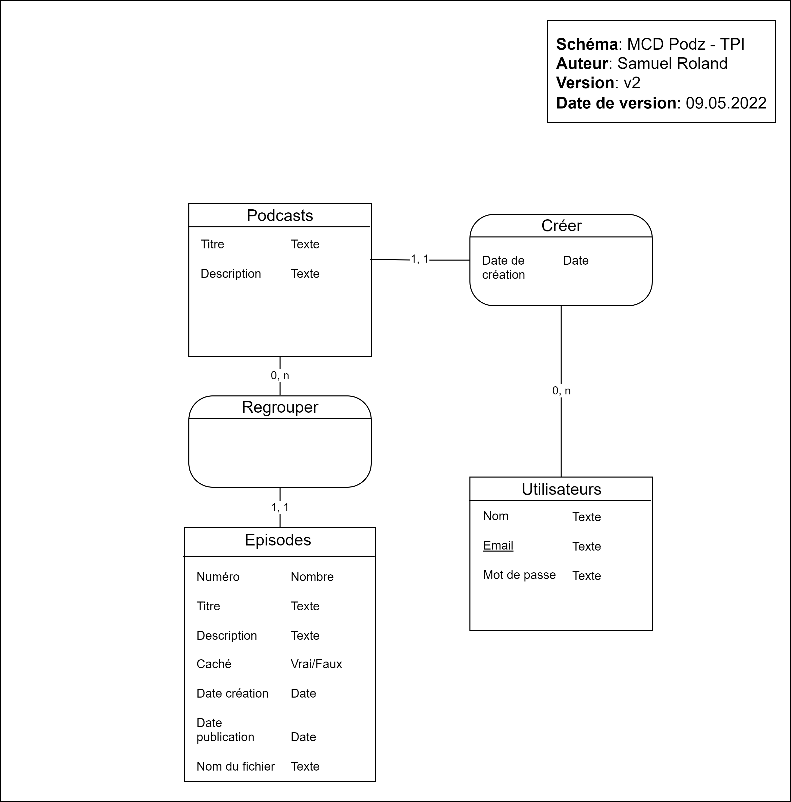

<div style="text-align: center; padding: 150px 0px;">
<p style="text-align: center; border: none; font-size: 3rem;">Documentation de Podz</p>
<p style="text-align: center; border: none; font-size: 2rem;">Application web de publication de podcasts</p>
<div style="display:flex; padding: 50px 100px; justify-content: center; font-family: Fira Code;">

</div>
<h2 style="text-align: center; font-size: 1.8rem;">Projet TPI - 2022</h2>
<h2 style="text-align: center; font-size: 1.5rem;">Samuel Roland</h2>

</div>

<div class="page"/> 

<div class="toc">

**Table des matières**
- [Analyse préliminaire](#analyse-préliminaire)
  - [Introduction](#introduction)
  - [Glossaire](#glossaire)
  - [Objectifs](#objectifs)
  - [Planification initiale](#planification-initiale)
- [Analyse / Conception](#analyse--conception)
  - [Concept](#concept)
    - [Technologies utilisées](#technologies-utilisées)
    - [Outils d'aide](#outils-daide)
    - [Base de données: MCD](#base-de-données-mcd)
    - [Base de données: MLD](#base-de-données-mld)
    - [Maquettes](#maquettes)
  - [Stratégie de test](#stratégie-de-test)
    - [Où sont écrits les tests ?](#où-sont-écrits-les-tests-)
    - [Prérequis pour lancer les tests](#prérequis-pour-lancer-les-tests)
    - [Comment lancer les tests ?](#comment-lancer-les-tests-)
  - [Planification](#planification)
  - [Dossier de conception](#dossier-de-conception)
    - [Upload d'un fichier audio pour la création d'un épisode](#upload-dun-fichier-audio-pour-la-création-dun-épisode)
    - [Eléments réutilisables](#eléments-réutilisables)
- [Réalisation](#réalisation)
  - [Dossier de réalisation](#dossier-de-réalisation)
  - [Résultats des tests effectués](#résultats-des-tests-effectués)
    - [Couverture des tests](#couverture-des-tests)
  - [Liste des documents fournis](#liste-des-documents-fournis)
- [Conclusions](#conclusions)
  - [Objectifs atteints / non-atteints](#objectifs-atteints--non-atteints)
  - [Bilan personnel](#bilan-personnel)
  - [Suites possibles au projet](#suites-possibles-au-projet)
- [Annexes](#annexes)
  - [Résumé du rapport du TPI](#résumé-du-rapport-du-tpi)
  - [Sources – Bibliographie](#sources--bibliographie)
  - [Journal de travail](#journal-de-travail)
  - [Manuel d'Installation](#manuel-dinstallation)
  - [Archives du projet](#archives-du-projet)

</div>

<div class="page"/><!-- saut de page -->

## Analyse préliminaire
### Introduction

Podz est une application web de publication de podcasts, pour le projet de TPI de Samuel Roland. Les auteurs peuvent créer des podcasts, publier des épisodes, planifier la publication d'épisodes dans le futur et les cacher. L'application est basée sous Laravel 9 et ne part pas d'un projet existant. <!-- pas "part de zéro" -->

### Glossaire

- BDD Behavior Driven Development
- CSS: Cascading Style Sheets
- HTML: Hypertext Markup Language
- IDE: Integrated Development Environment
- MCD: Modèle Conceptuel de Données
- MLD: Modèle Logique de Données
- MVC: Modèle Vue Contrôleur
- PHP: PHP Hypertext Preprocessor
- POO: Programmation orientée objet
- TALL: TailwindCSS - AlpineJS - Livewire - Laravel : stack de 4 frameworks web

### Objectifs

Voici la liste des objectifs à atteindre, tirée du cahier des charges:

**Fonctionnalités générales (reprises d’un ancien projet)**
- Création de comptes utilisateurs.
- Authentification des utilisateurs.
- Il n’y aura pas de partie back-office ni de rôle administrateur.

Ces fonctionnalités sont implémentées par Jetstream, je n'ai donc pas eu besoin de m'en occuper.

**Fonctionnalités détaillées selon le type d’utilisateur**
- En tant que visiteur (personne non authentifiée) :
  - Consultation de la liste des podcasts.
  - Consultation du détail d’un podcast : épisodes
  - Ecoute d’un épisode d’un podcast.
- En tant qu’utilisateur authentifié, en plus des fonctionnalités accessibles à tout visiteur :
    - Création d’un nouveau podcast, édition d’un de ses podcasts existant.  
  - Sur l’un de ses podcasts :
    - Affichage de la liste des épisodes avec toutes les données liées.
    - Ajout d’un nouvel épisode.
    - Edition d’un épisode.
    - Suppression d’un épisode.

todo: ajouter critères spécifiques
<!-- 

Ce chapitre énumère les objectifs du projet. L'atteinte ou non de ceux-ci devra pouvoir être contrôlée à la fin du projet. Les objectifs pourront éventuellement être revus après l'analyse. 

Ces éléments peuvent être repris des spécifications de départ.
-->

### Planification initiale
<!--
Ce chapitre montre la planification du projet. Celui-ci peut être découpé en tâches qui seront planifiées. Il s'agit de la première planification du projet, celle-ci devra être revue après l'analyse. Cette planification sera présentée sous la forme d'un diagramme.

Ces éléments peuvent être repris des spécifications de départ.
-->
<div class="page"/>

## Analyse / Conception
### Concept

TODO ???? retirer =

L'application tourne en PHP sur un serveur Apache. Elle utilise une base de données MySQL pour stocker ses données.

#### Technologies utilisées
J'ai choisi la stack **TALL** (*TailwindCSS - AlpineJS - Livewire - Laravel*) pour ce projet, car je suis à l'aise avec ces 4 frameworks et parce qu'ils permettent d'être productif pour développer une application web.

**Petits aperçus de ces frameworks**
- **[Laravel](https://laravel.com/)**: un framework PHP basé sur le modèle MVC et en POO. Laravel donne accès à beaucoup de classes et fonctions très pratiques, d'avoir une structure imposée, d'avoir des solutions simples aux récurrents (traductions, authentification, gestion des dates, ...). Tout ceci simplifie beaucoup le développement d'applications web en PHP une fois qu'on ait à l'aise avec les bases.
- **[Livewire](https://laravel-livewire.com/)**: un framework pour Laravel permettant de faire des composants fullstack réactifs. L'idée est d'utiliser la puissance de Blade et du PHP pour avoir des parties réactives sur le frontend (normalement codé en Javascript) sans devoir coder des requêtes AJAX.
- **[AlpineJS](https://alpinejs.dev/)**: un petit framework Javascript relativement simple à apprendre, utilisée ici pour gérer certaines interactions que Livewire ne permet pas, ou qui concernent des états d'affichage (là où des requêtes sur le backend seraient inutiles). Les composants s'écrivent inline (sur les balises HTML directement). Très pratique pour afficher un dropdown, faire une barre de progression, ...
- **[TailwindCSS](https://tailwindcss.com/)**: un framework CSS, concurrent de Bootstrap mais centré autour des propriétés CSS (en ayant des classes utilitaires - "utility-first") au lieu de tourner autour de composants. C'est très puissant pour construire rapidement des interfaces, en écrivant quasiment jamais de CSS pur et pour faire du responsive c'est très pratique parce qu'on peut préfixer toutes les classes par `md:` par ex. afin dire que la classe ne s'applique que sur les écrans medium et au dessus.

- **[Jetstream](https://jetstream.laravel.com/2.x/introduction.html)**: Un starter Kit Laravel mettant en place les fonctionnalités d'authentification, tels que la connexion, la création de compte, la gestion du compte et beaucoup d'autres. L'option Livewire a été utilisée.

#### Outils d'aide
Pour m'aider dans mon développement, j'ai utilisé différent outils, ils ne sont pas indispensables mais peuvent être très utiles:
- **[Clockwork](https://underground.works/clockwork/)**: paquet Composer et extension web pour debugger les performances, les requêtes SQL, voir le temps d'exécution, ... Le paquet Composer est déjà installé.

- **[Laravel Valet](https://laravel.com/docs/9.x/valet)**: fait tourner des serveurs web avec Nginx les rendant accessibles via des domaines en .test. Ce qui me permet de faire tourner mon serveur sous `podz.test` sans avoir besoin de me soucier de démarrer et d'arrêter ce serveur ni de gérer plusieurs ports quand plusieurs serveurs sont allumés. Fonctionne pour MacOS, mais des forks pour [Windows](https://github.com/cretueusebiu/valet-windows) et [Linux](https://cpriego.github.io/valet-linux/) existent également. Attention à bien suivre la procédure d'installation pour ne pas être coupé d'internet à cause du DNS local mal configuré.


</div>

<div class="page"/>

#### Base de données: MCD

</div>

**Spécificités dans Episodes**:
- Les combinaisons du Numéro et du podcast lié, ainsi que le titre et le podcast lié, sont uniques (exemple: on ne peut pas avoir 2 fois un épisode 4 du podcast "Summer stories", et on ne peut pas avoir 2 fois un épisode nommé "Summer 2020 review" du podcast "Summer stories").
- La date de création est définie par la date de création de l'épisode sur la plateforme (avec l'upload du fichier), peu importe ses autres informations (la publication ou l'état caché n'a pas d'influence sur cette date). Cette date ne change jamais et est affichée qu'à l'auteur.
- La date de publication peut être dans le passé ou mais aussi dans le futur. Si elle est dans le futur, l'épisode n'est pas encore publié (jusqu'à la date définie). Ceci permet de programmer dans le futur une publication.
- Le champ Caché est par défaut à Faux et n'a pas d'effet dans ce cas. S'il est Vrai, l'épisode ne sera pas visible dans les détails du podcast.

**Spécificités dans Podcasts**:
- La combinaison du titre et de l'auteur est unique. Exemple: Michelle ne peut pas publier 2 podcasts s'appelant "My story", par contre Michelle et Bob peuvent chacun publier 1 podcast nommé "My story".

<div class="together">

#### Base de données: MLD


Ce MLD n'a pas été fait à la main mais a été rétro-ingéniéré depuis la base de données, après avoir codé les migrations. Certains champs sont créés par une migration générée par Jetstream, je n'en ai pas besoin mais je ne vais pas les retirer au risque de casser certaines parties existantes. Ce MLD omet volontairement les tables générées par Laravel et propres à chaque application Laravel (`sessions`, `migrations`, ...), une partie provient de migrations créées par Jetstream. Ne vous étonnez donc pas de trouver d'autres tables dans la base de données, car je ne les utilise pas directement. 

todo: documenter spécificités.
Les champs `created_at` et `updated_at` sont gérés automatiquement par Laravel, je n'utilise que le `created_at` en lecture seulement.

<!--
Le concept complet avec toutes ses annexes :

Par exemple : 
•	Multimédia: carte de site, maquettes papier, story board préliminaire, …
•	Bases de données: interfaces graphiques, modèle conceptuel.
•	Programmation: interfaces graphiques, maquettes, analyse fonctionnelle…
•	…
-->
<div class="together">

#### Maquettes
Pour pouvoir utiliser les fonctionnalités requises, voici la liste complète des pages existantes et leur maquette:

- Page Connexion
- Page Inscription
- Page Liste des podcasts
- Page Détails d'un podcast (visiteur)
- Page Détails et édition d'un podcast (auteur)
- Page Création d'un podcast

</div>

**Page Connexion**  


**Page Inscription**  


<div class="together">

**Page Liste des podcasts**  
Cette page est visible publiquement et c'est la page par défaut de l'application, on y accède également via le bouton Podcasts en haut à gauche. On peut cliquer sur un podcast pour accéder à ses détails.

</div>

<div class="together">

**Page Détails d'un podcast**

**Vue visiteur**  
Les visiteurs ne voient que les épisodes qui sont visibles et qu'une partie de leurs informations. Ils ne voient que le numéro, le titre, la description, l'audio et la date (mais sans l'heure et la minute de publication).

</div>

<div class="together">

**Vue Détails et édition pour auteur**  
L'auteur voit toutes les informations de ses podcasts contrairement au visiteur. L'auteur a une vue visiteur sur les podcasts qui ne lui appartiennent pas. Nous sommes le 09.05.2022 dans cette maquette, l'épisode 4 est caché et le 5 est planifié pour le 10.05.2022 à 15:08. L'épisode 4 est caché parce que l'auteur a décidé après coup de le remettre en privé. Voici l'apparance de la page quand un auteur la charge.

Quand l'auteur clique sur les icônes d'édition, des formulaires s'affichent pour les éléments sélectionnés afin de permettre l'édition ou la suppression. Ici l'auteur crée un 5 ème épisode planifiée qui ne sera publié que le lendemain à 15h08. On peut éditer plusieurs éléments à la fois, il n'y aura pas de conflit.


</div>

<div class="together">

**Page Création d'un podcast**  
Simple formulaire pour créer un nouveau podcast, avec affichage des erreurs en dessous des champs si jamais les valeurs rentrées sont invalides.

</div>

<div class="together">

### Stratégie de test

<!--

Décrire la stratégie globale de test: 

•	types de des tests et ordre dans lequel ils seront effectués.
•	les moyens à mettre en œuvre.
•	couverture des tests (tests exhaustifs ou non, si non, pourquoi ?).
•	données de test à prévoir (données réelles ?).
•	les testeurs extérieurs éventuels.
-->

Cette section concerne la manière dont est testé Podz durant le projet et à la fin. Je teste manuellement les fonctionnalités dans son navigateur (Firefox) et écrit aussi des tests automatisés avec PHPUnit (un framework PHP de tests). La plupart des fonctionnalités sont couvertes par ces tests automatisés et quand cela n'est pas le cas, je regarde à la main si cela fonctionne. Les factories et le seeder écrits sont également très utile pour les tests. 

La stratégie de développement est le BDD (Behavior Driven Development). Cela consiste à écrire des tests qui testent le comportement avant de coder, s'assurer que le test plante, puis développer jusqu'à que le test passe. Ensuite on peut refactoriser pour augmenter la qualité tout en s'assurant que cela fonctionne.  
Toute la suite de tests est lancée très fréquemment (plusieurs fois par jour) pour s'assurer qu'une nouvelle fonctionnalité n'a pas cassé une autre en chemin.
</div>
<!-- todo: check BDD meaning -->

#### Où sont écrits les tests ?
Tous les tests se trouve dans le dossier `tests` à la racine du repository. Le dossier `Feature` contient les tests fonctionnels, `Unit` les tests unitaires et `Jetstream` les tests créé par Jetstream (ces derniers ont été déplacé de `Feature` afin de ne pas les exécuter constamment).

<!-- Check "test fonctionnel" -->

<div class="together">

</div>

#### Prérequis pour lancer les tests
Il est nécessaire d'avoir mis en place le projet et d'avoir l'extension PHP SQLite.

<!-- todo: à corriger -->
Avant chaque test, on retourne à l'état initiale grâce au trait `RefreshDatabase`. Puis le seeder `DatabaseSeeder` s'exécute graĉe au `$seed` défini à `true`. Ces 2 configurations sont faites dans `tests/TestCase.php`, ce qui permet au final que tous les tests sont lancées sur une base de données propre et remplie.

Afin de ne pas impacter la base de données de développement, les tests sont lancés sur une base de données SQLite en mémoire. Voici les lignes en bas du fichier de configuration de PHPUnit `phpunit.xml`, qui redéfinit 2 variables d'environnement permettant d'avoir une base de données en RAM.
```xml
<env name="DB_DATABASE" value=":memory:"/>
<env name="DB_CONNECTION" value="sqlite"/>
```
<div class="together">

#### Comment lancer les tests ?
Il y a différentes manières de lancer les tests dans un terminal dans le dossier du projet:
- `./vendor/bin/phpunit`
- `php artisan test`
- `phpunit` (si phpunit a été installé séparement)

Les tests en dehors du dossier `tests/Unit` et `tests/Feature` ne seront pas lancés. Pour exécuter les tests de Jetstream si besoin, il faut lancer `php artisan test tests/Jetstream`.

Vous pouvez passer des paramètres à `phpunit` (aussi possible pour la commande `php artisan test`).
</div>

**Exemples**:
1. pour exécuter seulement 1 test nommé `podcasts_page_exists`:  
`php artisan test --filter podcasts_page_exists`
1. pour exécuter une classe de tests donnée:  
`php artisan test tests/Feature/PodcastsTest.php`
1. pour exécuter les tests d'un dossier:  
`php artisan test tests/Unit`

Je recommande de configurer un raccourci dans votre IDE pour lancer les tests. J'ai utilisé ce réglage de raccourci dans VSCode pour lancer tous les tests lors d'un `ctrl+t ctrl+t`
```json
{
    "key": "ctrl+t ctrl+t",
    "command": "workbench.action.terminal.sendSequence",
    "args": {
        "text": "php artisan test\u000D"
    }
}
```

### Planification
<!--
Révision de la planification initiale du projet :

•	planning indiquant les dates de début et de fin du projet ainsi que le découpage connu des diverses phases. 
•	partage des tâches en cas de travail à plusieurs.

Il s’agit en principe de la planification définitive du projet. Elle peut être ensuite affinée (découpage des tâches). Si les délais doivent être ensuite modifiés, le responsable de projet doit être avisé, et les raisons doivent être expliquées dans l’historique.
-->

### Dossier de conception

**Résumé des podcats**  
Sur la page Podcasts, il y a un résumé des descriptions des podcasts, qui se limitent à 150 charactères (+3 petits points), puisque la description est trop longue pour être affichée entièrement et l'utilisation de `text-overflow: ellipsis` en CSS sur plusieurs lignes n'est pas très simple. Raccourcir en PHP était donc l'autre solution. Un attribute `summary` de la classe `Podcast` permet de récuperer facilement ce résumé. Si la description est plus courte que la limite, la description est utilisée.

**Visibilité des épisodes**

<!-- random note 

Pour qu'un épisode soit visible publiquement il faut que sa date de publication soit dans le passé et que son état Caché soit Faux.
-->

**Traduction**  
Pour que les messages d'erreurs soient en français. J'utilise le système d'internationalisation de Laravel et j'ai défini le français comme langue par défaut et l'anglais comme langue de repli ("fallback language") au cas où quelquechose n'aurait pas été traduit en français. J'ai dupliqué le fichier `lang/fr/validation.php` à partir `lang/en/validation.php` et j'ai traduit les erreurs que j'utilisais.


<!--
Fournir tous les document de conception:

•	le choix du matériel HW
•	le choix des systèmes d'exploitation pour la réalisation et l'utilisation
•	le choix des outils logiciels pour la réalisation et l'utilisation
•	site web: réaliser les maquettes avec un logiciel, décrire toutes les animations sur papier, définir les mots-clés, choisir une formule d'hébergement, définir la méthode de mise à jour, …
•	bases de données: décrire le modèle relationnel, le contenu détaillé des tables (caractéristiques de chaque champs) et les requêtes.
•	programmation et scripts: organigramme, architecture du programme, découpage modulaire, entrées-sorties des modules, pseudo-code / structogramme…

Le dossier de conception devrait permettre de sous-traiter la réalisation du projet !
-->
#### Upload d'un fichier audio pour la création d'un épisode
J'ai décidé de fixer la taille maximum d'upload de fichiers à 150MB. Cette limite est fixée dans l'application, au niveau de la validation à la création d'un épisode.
Ces 2 paramètres dans la configuration de PHP (fichier `php.ini`) doivent être augmentées au dessus de 150MB: `upload_max_filesize` et `post_max_size`.

#### Eléments réutilisables

**Le composant Field**  
Un composant Blade permettant d'abstraire les éléments communs à tous les champs de formulaire: l'affichage du label, le design basique, l'affichage des erreurs de validations.

Propriétés du composant
| Nom           | Type   | Requis | Description                                                                                                           |
| ------------- | ------ | ------ | --------------------------------------------------------------------------------------------------------------------- |
| `name`        | String | X      | Le nom technique du champ, utilisé pour l'attribut `name` de l'input et par le `@error()` et par la fonction `old()`. |
| `label`       | String |        | Nom du label au dessus du champ.                                                                                      |
| `type`        | String |        | Type de l'`<input>`. Par défaut `text`. Si `textarea` est donné, une balise `<textarea>` est utilisée à la place.     |
| `placeholder` | String |        | Un placeholder qui est ajouté directement sur le champ.                                                               |
| `cssOnField`  | String |        | Des classes CSS qui sont ajoutées directement sur le champ.                                                           |

Tous les autres attributs non reconnus sont transférés à la `div` racine du composant, ce qui permet d'ajouter du style ou d'autres attributs HTML. Tous les attributs commençant par `wire:model` sont ajoutés au champ pour permettre l'utilisation de ce composant avec Livewire.

Exemple d'utilisation:
```php
<form action="{{ route('podcasts.index') }}" method="POST">
<x-field label="Title" name="title"></x-field>
<x-field label="Description" type="textarea" name="description"></x-field>
<x-field label="Date de naissance" type="date" name="user.date"></x-field>
[...]
</form>
```

Un autre exemple d'utilisation dans le cas d'un formulaire géré par Livewire:
```php
<div>
    <x-field 
        wire:keyup.enter="update" 
        placeholder="Rentrez un titre court et marquant." 
        label="Title" name="podcast.title" 
        wire:model.lazy="podcast.title">
    </x-field>
    <x-field 
        label="Description" type="textarea" 
        name="podcast.description" wire:model.lazy="podcast.description">
    </x-field>
    @csrf
    <button wire:click.prevent="update" class="btn mt-1">Enregistrer</button>
</div>
```

**Classes CSS et couleurs**  
J'ai défini 3 nouvelles couleurs Tailwind, qu'on peut utiliser partout où les couleurs sont utiles avec TailwindCSS (`border-green`, `text-lightblue`, ...)
```javascript
//Extrait de tailwind.config.js
colors: {
    'green': '#0d9488',
    'blue': '#0d1594',
    'lightblue': '#0d159414',
}
```

Il y a aussi certaines classes CSS qui peuvent être utilisées pour avoir un design commun à travers l'interface:
- `text-info`: pour les messages d'informations
- `btn`: pour les boutons

<div class="page"/>

## Réalisation
### Dossier de réalisation

<!-- réduire taille du texte pour éviter les overflow-->
**Structure du repository**  
Certains dossiers de Laravel moins pertinents ont été remplacés par des `...`. Seulement les dossiers et les fichiers à la racine sont affichés. Uniquement ceux que j'ai utilisé sont définis.

```
podz                      Racine du repository
├─ app                                        
│   ├─ Actions                                        
│   │   ├─ Fortify                                        
│   │   └─ Jetstream                                        
│   ├─ Console                                        
│   ├─ Exceptions                                         
│   ├─ Http                                         
│   │   ├─ Controllers    Les classes contrôleurs                                    
│   │   ├─ Livewire                                         
│   │   └─ Middleware                                         
│   ├─ Models             Les classes modèles                            
│   ├─ Providers                                        
│   └─ View               Les classes des vues, pour les composants Blade                          
│       └─ Components                                         
├─ ...                                      
├─ config                 Les fichiers de configuration globaux                        
├─ database               Tout ce qui concerne la gestion de la base de données                          
│   ├─ factories          Les factories pour créer des données fictives                              
│   ├─ migrations         Les migrations pour définir la structure des tables
│   └─ seeders            Les seeders pour remplir la base de données avec les factories
├─ docs                   Dossier pour stocker les éléments de documentations (notamment MCD, MLD)
│   ├─ imgs               Les images utilisées dans cette documentation
│   ├─ models             Les exports des maquettes
│   └─ sources            Les fichiers source binaires des maquettes, MCD et MLD
├─ lang                   Les fichiers de langues                      
│   ├─ en                 
│   └─ fr                 Certaines traductions en français                         
├─ public                 
├─ resources              Toutes les ressources utiles à générer nos vues                          
│   ├─ css                Style CSS global dans app.css                         
│   ├─ js                 Javascript global dans app.js                        
│   ├─ markdown           
│   └─ views              
│       ├─ api            
│       ├─ auth           
│       ├─ components     
│       ├─ layouts        
│       ├─ livewire       Les vues pour Livewire
│       ├─ podcasts       Vues pour les podcasts 
│       ├─ profile                               
│       └─ vendor                                
│           └─ jetstream  Les vues de Jetstream  
│               └─ ...                                          
├─ routes                 Configuration des routes dans web.php                        
├─ storage                Espace de stockage dédié                        
│   ├─ app                Dossier ciblé par le disque "local"                         
│   │   ├─ public         Dossier publiquement accessible et ciblé par le disque "public"                                
│   │   └─ testing        Fichiers audios de tests pour le développement                              
│   ├─ clockwork                                        
│   ├─ ...                                        
│   └─ logs               Emplacement de laravel.log                          
├─ tests                  Tests automatisés                      
│   ├─ Feature            Tests fonctionnels                            
│   ├─ Jetstream          Tests créés par Jetstream                              
│   └─ Unit               Tests unitaires 
│                        
│   .editorconfig                                       
│   .env.example          Fichier .env d'exemple                              
│   .gitattributes                                        
│   .gitignore                                        
│   .styleci.yml                                        
│   artisan                                       
│   composer.json         Liste des paquets Composer requis                              
│   composer.lock         Liste des paquets Composer installées et leur version
│   package-lock.json     Liste des paquets NPM installées et leur version
│   package.json          Liste des paquets NPM requis                              
│   phpunit.xml           Fichier de configuration de PhpUnit                             
│   README.md                                        
│   tailwind.config.js    Configuration de Tailwind                                    
│   webpack.mix.js        Configuration du build JS et CSS avec Webpack pour Mix
```
<!--

Décrire la réalisation "physique" de votre projet

•	les répertoires où le logiciel est installé
•	la liste de tous les fichiers et une rapide description de leur contenu (des noms qui parlent !)
•	les versions des systèmes d'exploitation et des outils logiciels
•	la description exacte du matériel
•	le numéro de version de votre produit !
•	programmation et scripts: librairies externes, dictionnaire des données, reconstruction du logiciel - cible à partir des sources.

NOTE : Evitez d’inclure les listings des sources, à moins que vous ne désiriez en expliquer une partie vous paraissant importante. Dans ce cas n’incluez que cette partie…
-->

### Résultats des tests effectués
<!-- Compléter temps !! -->
Cette capture montre le résultat des tests exécutés le YYY à YYY. Tous les tests passent.


<!-- todo: check selenium and testing tools -->
Voici la liste complète des tests, les noms devraient permettre d'avoir une idée de ce qui est testé et quels cas sont couverts.

<!-- todo: update the list and names if changed in between! -->
1. **Tests\Unit\EpisodeTest**
    1. `path is well built`

2. **Tests\Unit\PodcastTest**
    1. `podcasts summary is correctly extracted`
    2. `podcasts summary doesnt extract when description length is already good`
    3. `get next number really gives next number`

3. **Tests\Feature\EpisodeCreationTest**
    1. `podcast details page uses episode creation component`
    2. `podcast details page doesnt use episode creation if not author`
    3. `episode creation works`
    4. `data are correctly validated`
    5. `audio file type is validated`
    6. `default value of the episode are set`
    7. `publishing fails silently if forbidden`
    8. `publishing 2 episodes with same title in a podcast is not possible`

4. **Tests\Feature\EpisodeDeletionTest**
    1. `episode deletion works`
    2. `episode deletion is only authorized to the author`

5. **Tests\Feature\EpisodeUpdateTest**
    1. `podcast details page uses episode update component`
    2. `podcast details page doesnt use episode update if not author`
    3. `episode update works`
    4. `data are correctly validated`
    5. `datetime value is set after mount`
    6. `update fails silently if forbidden`
    7. `updating title to another episode title in the same podcast fails`

6. **Tests\Feature\PodcastCreationTest**
    1. `create a podcast page exists`
    2. `create a podcast page is guarded`
    3. `store route is guarded`
    4. `podcast creation works`
    5. `podcast is not created on invalid request`
    6. `new podcast button is present`
    7. `new podcast button doesnt exist as visitor`

7. **Tests\Feature\PodcastDetailsTest**
    1. `podcasts details page exists`
    2. `podcast info component is included in the page`
    3. `all information are displayed for the author`
    4. `a message is displayed when no episode is published`
    5. `prefix text of future release date is displayed correctly for author`
    6. `release date displays only date for the public`
    7. `future episodes are not publicly visible`
    8. `past hidden episodes are nt visible for the public`
    9. `only required info are displayed publicly`

8. **Tests\Feature\PodcastUpdateTest**
    1. `podcast details page contains update component`
    2. `podcast details page doesnt contain update component as visitor and as non author`
    3. `details can be updated`
    4. `details must be valid`

9. **Tests\Feature\PodcastsTest**
    1. `podcasts page exists`
    2. `the page has title and description`
    3. `all podcasts are displayed with their data`


#### Couverture des tests
Comme les tests sont écrits et exécutés en PHP, les tests ne peuvent que tester le comportement backend. Les interactions frontend ne peuvent pas être testées avec les outils actuels.

Pour la plupart des fonctionnalités, j'ai suivi cette ordre pour décider des tests à écrire et de leur contenu:
1. D'abord écrire un test pour vérifier que la page existe ou que le composant testé est bien chargé dans une des pages.
2. Ensuite tester le comportement idéal (toutes les données valides) pour s'assurer que les données gérées ont bien été modifiées.
3. Puis tester les validations des données.
4. Et finalement valider les permissions de visibilité ou d'accès (ex: être sûr qu'un visiteur ne peut pas modifier un épisode ou ne peut pas voir d'épisode s'il est invisible).

<!-- check order and reorder if needed -->

**Ce que les tests ne couvrent pas**:
- Validation de la taille maximale d'upload d'un fichier pour la création d'épisode

Les tests manuels ont permis de vérifier que cela fonctionnait. Un test manuel avec un fichier mp3 de 170Mo a été fait plusieurs fois afin de vérifier la limite de 150Mo. En voici la démonstration:


<!--
### Erreurs restantes  

S'il reste encore des erreurs: 

•	Description détaillée
•	Conséquences sur l'utilisation du produit
•	Actions envisagées ou possibles
TODO: a retirer au dernier moment.
-->

### Liste des documents fournis
- Ce rapport de projet nommé "Documentation de Podz" <!-- nom du fichier -->
- Journal de travail
- README: contient la documentation d'installation du projet

<!--
todo: utile ?

Lister les documents fournis au client avec votre produit, en indiquant les numéros de versions 

•	le rapport de projet
•	le manuel d'Installation (en annexe)
•	le manuel d'Utilisation avec des exemples graphiques (en annexe)
•	autres…
-->

<div class="page"/>

## Conclusions
<!--

Développez en tous cas les points suivants:

•	Objectifs atteints / non-atteints
•	Points positifs / négatifs
•	Difficultés particulières
•	Suites possibles pour le projet (évolutions & améliorations)

 -->

### Objectifs atteints / non-atteints

**Fonctionnalités détaillées selon le type d’utilisateur**

| Objectif                                                                                      | Atteint ? |
| --------------------------------------------------------------------------------------------- | --------- |
| En tant que visiteur (personne non authentifiée) :                                            |           |
| - Consultation de la liste des podcasts.                                                      | Oui       |
| - Consultation du détail d’un podcast : épisodes                                              | Oui       |
| - Ecoute d’un épisode d’un podcast.                                                           |           |
| En tant qu’utilisateur authentifié, en plus des fonctionnalités accessibles à tout visiteur : |           |
| - Création d’un nouveau podcast, édition d’un de ses podcasts existant.                       | Oui       |
| Sur l’un de ses podcasts :                                                                    |           |
| - Affichage de la liste des épisodes avec toutes les données liées.                           | Oui       |
| - Ajout d’un nouvel épisode.                                                                  | Oui       |
| - Edition d’un épisode.                                                                       | Oui       |
| - Suppression d’un épisode.                                                                   | Oui       |

 <!--  todo -->

### Bilan personnel
J'ai eu beaucoup de plaisir à développer Podz, surtout avec l'écriture des tests. Contrairement à mon Pré-TPI où je n'avais pas pu terminer le développement et la documentation, je suis content d'avoir réussi à finir toutes les fonctionnalités demandées de justesse et d'avoir pu faire correctement la documentation.
Comme à mon Pré-TPI j'ai eu de la peine avec l'upload de fichiers, parce que je n'arrivais pas à écrire des tests correctement, je devais tester à la main et cela devenait vite chronophage. Grâce à l'aide M. Hurni mon chef de projet, j'ai pu changer de stratégie pour ces tests

### Suites possibles au projet
Pour la suite du projet.....
<div class="page"/>

## Annexes
<!-- todo: document séparé ?? -->
### Résumé du rapport du TPI
**Situation de départ**  
Le but du projet est de développer une application web avec Laravel de publication de podcasts. Pour les auteurs, il doit être possible de créer et modifier leurs podcasts, et créer, éditer et supprimer des épisodes dans leurs podcasts. Les épisodes doivent pouvoir être publié dans le futur et caché par l'auteur si besoin. Le projet est parti de rien (il ne s'appuie pas sur un autre projet). J'ai choisi d'appeler l'application Podz.  
Les critères spécifiques demandaient de faire une modélisation des données pertinentes, de respecter les principes du modèle MVC, d'avoir une interface utilisateur propre et utilisable. Il était aussi demandé de suivre les normes d'écriture de code, d'utiliser un système de versionning en faisant des petits commits atomiques. Les épisodes devaient aussi être correctement écoutable dans les navigateurs.

**Mise en oeuvre**  
En plus de l'utilisation du framework Laravel, j'y ai ajouté Livewire, AlpineJS et TailwindCSS. Ces 4 frameworks que j'avais utilisé en stage et pour des projets personnels forment la stack TALL et sont régulièrement utilisé dans l'écosystème Laravel.  
Pour ne pas avoir à développer la connexion et la création de compte, j'ai utilisé le starter kit Jetstream qui mettait déjà tout en place. J'ai fait mon MCD et MLD de ma base de données. J'ai réfléchi aux différentes pages nécessaires pour utiliser les fonctionnalités requises et j'ai fait des maquettes pour chacune des pages. La page de détails d'un podcast a en fait plusieurs vues, selon si l'on est visiteur ou auteur, et en tant qu'auteur on peut ouvrir ou fermer les formulaires pour modifier des épisodes ou les informations du podcast. Une fois cette analyse terminée, j'ai développé l'une après l'autre toutes les fonctionnalités demandées, tout en suivant ma planification. J'ai eu un peu d'avance au départ sur le premier sprint (j'ai avancé une tâche du sprint 2 au sprint 1) puis comme la création d'épisode avec l'upload de fichiers était plus complexe que je l'imaginais, j'ai eu un peu de retard sur mon planning, mais j'ai réussi à rattraper le retard à la fin et tout finir dans les temps.  
La particularité de mon TPI par rapport à d'autres élèves est que j'ai écrit de nombreux tests automatisés pour m'assurer que la majeure partie du comportement de mon application était correct et restait fonctionnel tout le long du projet. PHPUnit était utiliser pour écrire ces tests, qui on pris un peu de temps à être écrit mais qui permettait d'accélerer la validation du fonctionnement, j'ai ainsi pu éviter beaucoup d'essais à la main puisque j'avais confiance sur le fait que mon backend fonctionne. Il restait bien sûr à s'assurer que tout fonctionnait comme prévu dans mon navigateur mais cela était plus rapide à déterminer.

**Résultats**


<div class="page"/>


### Sources – Bibliographie
- Icônes: les icônes ont été copié-collées (en SVG) depuis [heroicons.com](https://heroicons.com/), elle sont publiées sous licence MIT.

- [Liste des Types de médias, par l'IANA](https://www.iana.org/assignments/media-types/media-types.xhtml). Cette ressource m'a été utile pour trouver les types MIME des fichiers audios .ogg, .opus, .mp3 et .m4a.

Pour résoudre mes différents problèmes j'ai utilisé StackOverflow et les documentations officielles des 4 frameworks que j'utilise:
- **[Documentation de Laravel](https://laravel.com/docs)**
- **[Documentation de Livewire](https://laravel-livewire.com/docs)**
- **[Documentation de AlpineJS](https://alpinejs.dev/docs)**
- **[Documentation de TailwindCSS](https://tailwindcss.com/docs)**

J'ai aussi utilisé le site **[Mozilla Developer Network]**(https://developer.mozilla.org/fr/) comme référence pour le HTML et le CSS.

<!--

Liste des livres utilisés (Titre, auteur, date), des sites Internet (URL) consultés, des articles (Revue, date, titre, auteur)… Et de toutes les aides externes (noms)   
-->
### Journal de travail
Le journal est disponible en document séparé ou directement sur en Markdown [en Markdown](https://github.com/samuelroland/podz/blob/main/docs/podz-journal.md) ou [en PDF](https://github.com/samuelroland/podz/blob/main/docs/podz-journal.md)

### Manuel d'Installation
todo

### Archives du projet 

<!-- 
Media, … dans une fourre en plastique 
-->